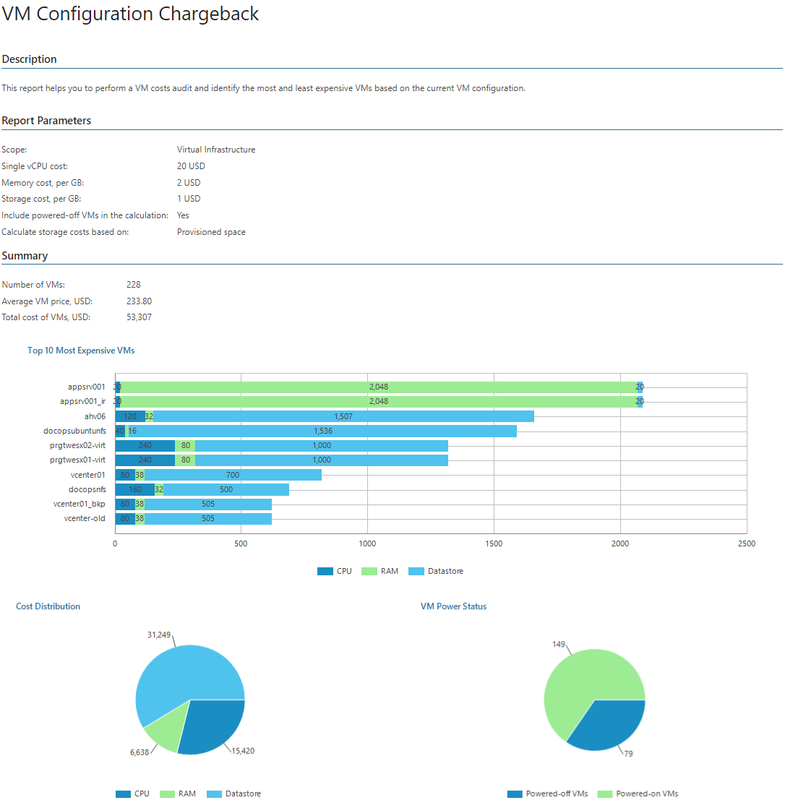

# VM Configuration Chargeback

This report helps to make VM cost audit and identify the most and least expensive VMs based on the VM configuration.

The report analyzes VM cost based on flat fees for vCPU, vRAM and storage resources provisioned for a VM.

* The Summary section includes the following elements:

+ Details on the number of VMs, average VM cost and total cost of VMs.
+ The Top 10 Most Expensive VMs subsection shows 10 most expensive VMs in terms of allocated resources, and provides cost of vCPU, vRAM and storage resources configured for each VM.
+ The Cost Distribution chart shows the cost of hardware CPU, memory and storage resources.
+ The VM Power Status chart shows the number of running and powered-off VMs. This chart is available if you choose to include powered-off VMs in the report.
+ The Business View Groups Cost chart shows the cost of VMs included in Business View groups. This chart is available if you include Business View groups in the report scope.

* The Details table provides information on VM configuration cost in terms of vCPU, vRAM, storage and total cost.

|  |
| --- |
| Note: |
| * For VMs with thin-provisioned or dynamic disks, the report takes into account the amount of provisioned disk space, not actually used disk space. * For VMs with dynamic memory, the report takes into account the amount of allocated memory. |

Report Parameters

You can specify the following report parameters:

* Infrastructure objects: defines a virtual infrastructure level and its sub-components (hosts) to analyze in the report.
* VMware Cloud Director objects: defines VMware Cloud Director components to analyze in the report.
* Business View objects: defines Business View groups to analyze in the report. The parameter options are limited to objects of the Virtual Machine type.

Business View groups from the same category are joined using Boolean OR operator, Business View groups from different categories are joined using Boolean AND operator. That is, if you select groups from the same category, the report will contain all objects that are included in groups. However, if you select groups from different categories, the report will contain only objects that are included in all selected groups.

* Currency: defines a payment currency.
* Single vCPU cost: defines the cost of one vCPU configured for a VM, in the selected currency.
* Memory cost, per GB: defines the cost of a memory GB allocated for a VM, in the selected currency.
* Storage cost, per GB: defines the cost of a storage GB allocated for a VM, in the selected currency.

* Calculate storage hosts based on: defines how VM storage host must be calculated in the report (Provisioned space, Used space).

* Include powered-off VMs in the calculation: defines whether powered-off VMs must be analyzed in the report.

Use Case

The report is intended for service providers that have flat fees on allocated virtual infrastructure resources. The report helps calculate the cost of resources that were allocated to each client or application owner, and bill tenants, clients and application owners according to the allocated resources.

IT departments can use this report to calculate the cost of provisioned VMs for application owners and business units, provided that the VM cost model in the organization is based on VM configuration.

