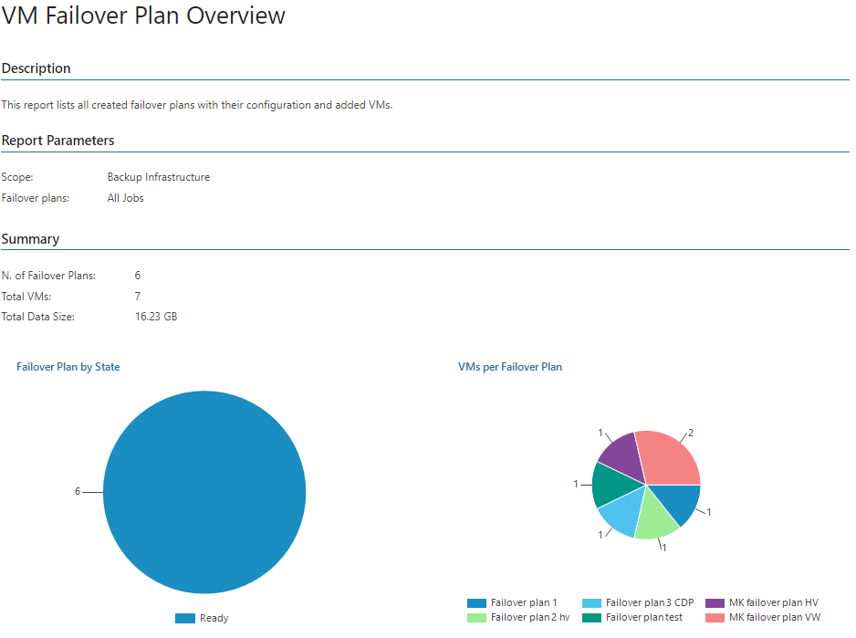
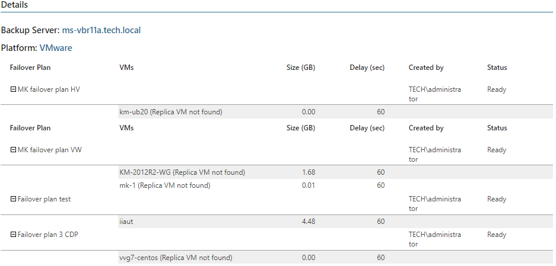

# VM Failover Plan Overview

This report analyzes configuration of regular and cloud failover plans, provides information on the number of VMs included in a failover plan and estimates the amount of data consumed by replica VMs on the target datastore.

* The Summary section includes the following elements:

+ The Failover Plan by State chart shows statuses of existing failover plans.
+ The VMs per Failover Plan chart shows the number of VMs comprised in each failover plan.

* The Details table shows VMs included in the failover plans, consumed storage capacity, the specified delay in a VM failover queue and the current plan state.

Report Parameters

You can specify the following report parameters:

* Infrastructure objects: defines a list of Veeam Backup & Replication servers to include in the report.
* Failover plans: defines a list of failover plans to include in the report.

Use Case

The report allows you to keep records of your failover plans for auditing purposes and compliance tests.

