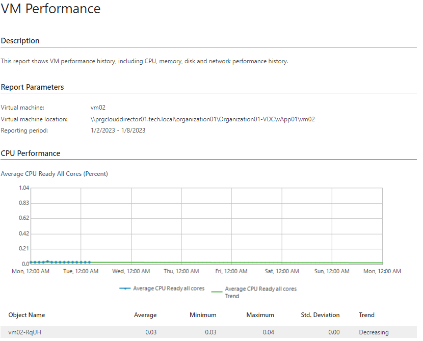

# VM Performance (VMware Cloud Director)

This report aggregates historical data and shows performance statistics for a selected VM across a time range.

* The Performance subsections show tables and performance charts with CPU, memory, disk and network usage statistics and displays resource usage trends.

Report Parameters

You can specify the following report parameters:

* Virtual machine: defines the VM that belongs to your organization and should be analyzed in the report.
* Period: defines the time period to analyze in the report.
* Business hours only: defines time of a day for which historical performance data will be used to calculate the performance trend. All data beyond this interval will be excluded from the baseline used for data analysis.

Use Case

The report allows you to verify that you have provided enough resources to the virtual machine.

