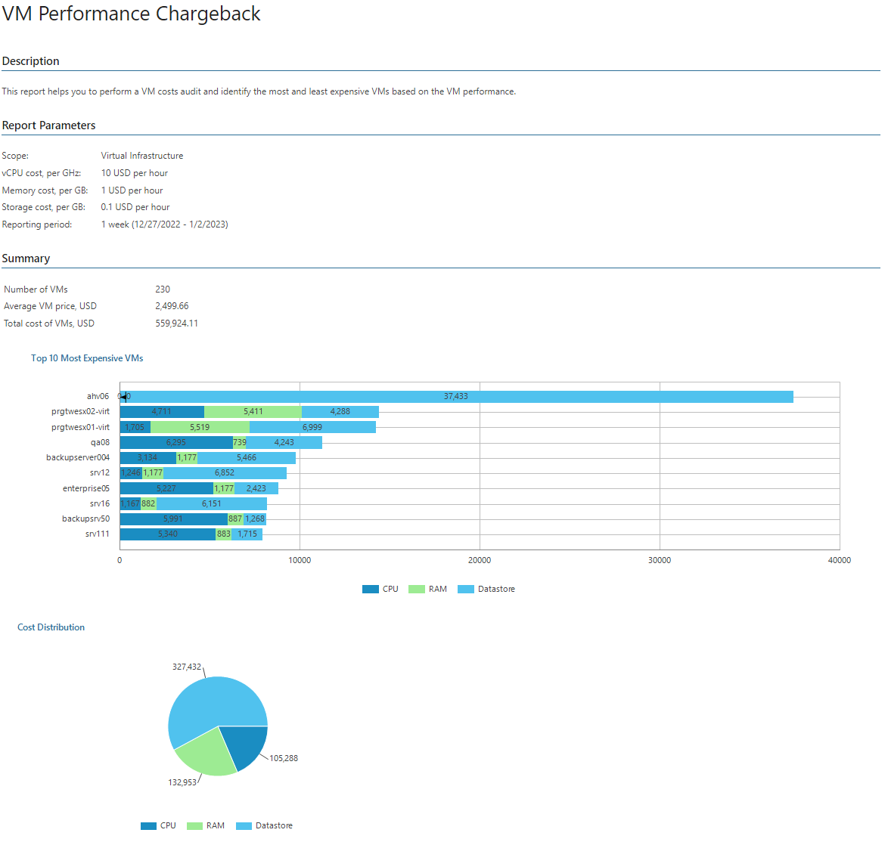
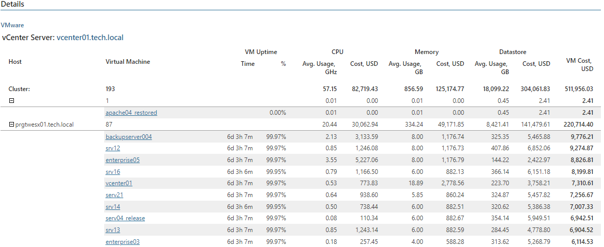
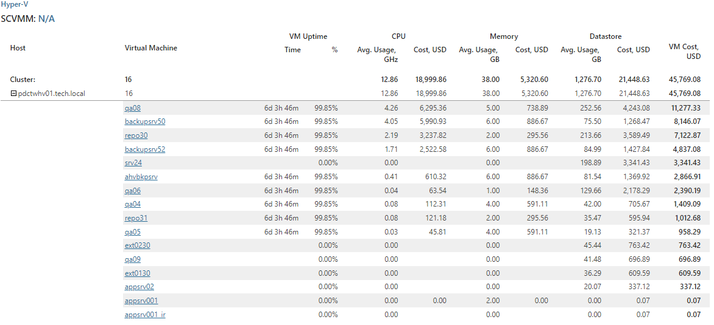

# VM Performance Chargeback

This report helps to make VM cost audit and identify the most and least expensive VMs based on the VM performance.

The report analyzes VM cost based on hourly, daily or weekly fees for consumed vCPU, vRAM and storage resources. The cost of VM resources is calculated based on VM uptime multipled by the cost of average CPU, memory and storage usage observed during a specified period.

* The Summary section includes the following elements:

+ Details on the number of VMs and Business View groups, average VM cost and total cost of VMs.

+ The Top 10 Most Expensive VMs subsection shows 10 most expensive VMs in terms of consumed resources, and provides cost of vCPU, vRAM and storage resources utilized by each VM.
+ The Cost Distribution chart shows the cost of vCPU, vRAM and storage resources for all VMs included in the report.
+ The Business View Groups Cost chart shows the cost of VMs for Business View groups included in the report. This chart is available if you include Business View groups in the report scope.

* The Details table provides information on the VM uptime during the reporting period, average vCPU, vRAM and storage usage values, cost of consumed resources, and cost of VMs for the reporting period. Click a VM name to drill down to detailed VM uptime, resource usage and cost statistics for the reporting period.

Report Parameters

You can specify the following report parameters:

* Infrastructure objects: defines a virtual infrastructure level and its sub-components (hosts) to analyze in the report.
* VMware Cloud Director objects: defines VMware Cloud Director components to analyze in the report.
* Business View objects: defines Business View groups to analyze in the report. The parameter options are limited to objects of the Virtual Machine type.

Business View groups from the same category are joined using Boolean OR operator, Business View groups from different categories are joined using Boolean AND operator. That is, if you select groups from the same category, the report will contain all objects that are included in groups. However, if you select groups from different categories, the report will contain only objects that are included in all selected groups.

* Currency: defines a payment currency.
* Calculate costs for each: defines a time measurement unit for which prices are set.
* vCPU cost, per GHz: defines a cost for each consumed CPU GHz.
* Memory cost, per GB: defines a cost for each consumed memory GB.
* Storage cost, per GB: defines a cost of each consumed storage GB.
* Period: defines a billing period that must be analyzed in the report. This is a period in the past for which historical performance data (CPU, memory and storage utilization metrics) must be analyzed in the report. Note that the reporting period must include at least one successfully completed Object properties data collection task for the selected scope. Otherwise, the report will contain no data.

* Business hours only: defines time of a day for which historical performance data must be used to calculate the VM cost. Data outside this interval will be excluded from the baseline used for data analysis.

Use Case

The report is intended for service providers that have flat fees on consumed virtual infrastructure resources. The report helps calculate the cost of resources that were utilized by each client or application owner for each hour, day or week, and bill the client or application owner according to allocated resources.

IT departments can use this report to calculate the cost of provisioned VMs for application owners and business units, provided that the VM cost model in the organization is based on the amount of resources that a VM consumes.

|  |
| --- |
| Note: |
| The cost of storage resources is calculated based on the amount of space occupied by VM files. Business hours do not affect the cost of storage resources. For example, if a VM consumes 100 GB space, and storage price is 0.1 USD per week, the total cost of storage resources for the VM will be 10 USD.  Note that the VM files growth factor can influence the cost of storage resources. The report calculates an average value of consumed storage space on each day of the specified interval. For example, if a VM occupied 50 GB at the beginning of the week, and grew up to 100 GB in the middle of the week, the average amount of occupied space will be 75 GB, and the total cost for the week will be 7.5 USD. |

Page updated 2026-07-31

