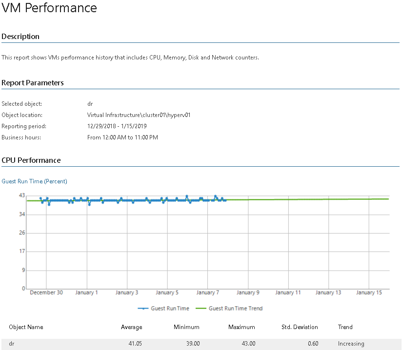

# VM Performance (Hyper-V)

This report aggregates historical data and shows performance statistics for a selected VM across a time range.

* The Performance subsections provide information on CPU, memory, disk and network usage and usage trends for the VM.

Report Parameters

You can specify the following report parameters:

* Object: defines the VM to analyze in the report.
* Period: defines the time period to analyze in the report. Note that the reporting period must include at least one successfully completed Object properties data collection task for the selected VM. Otherwise, the report will contain no data.
* Business hours only: defines time of a day for which historical performance data will be used to calculate the performance trend. All data beyond this interval will be excluded from the baseline used for data analysis.

Use Case

The report allows you to verify that you have provided enough resources to the virtual machine.

