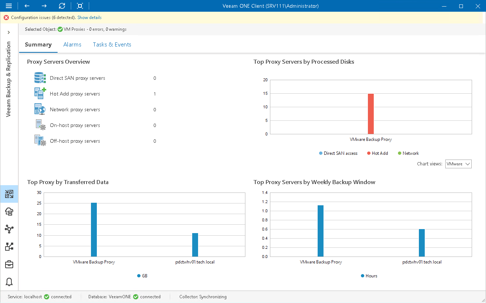

# VM Proxy Servers Overview

The summary dashboard for the VM Proxies node provides a configuration overview and performance analysis for VM proxies and file proxies managed by a backup server.

|  |
| --- |
| Note: |
| Veeam Cloud Connect service providers cannot see performance data for proxies used by tenant data protection jobs. |

Proxy Servers Overview

The section shows the breakdown of backup proxies by the transport or backup mode:

* [VMware vSphere] You can see how many VMware backup proxies retrieve VM data from source datastores using the Direct SAN Access, Hot Add or Network transport mode.

If a backup proxy uses different modes to retrieve VM data from various source datastores, Veeam ONE will detect its primary transport mode quantitatively, based on the number of processed VM disks. For example, if a backup proxy processed 10 VM disks using the Hot Add mode and 20 VM disks using the Network mode, the proxy would be reported as a 'Network proxy server'.

* [Microsoft Hyper-V] You can see how many Hyper-V proxies retrieve and process VM data in the on-host and off-host backup modes.

Top Proxy Servers by Processed Disks

The chart shows 5 backup proxies that processed the greatest number of VMs over the past 7 days.

To draw the chart, Veeam ONE analyzes how many VM processing tasks were successfully performed by every proxy; failed tasks are not taken into account.

The chart helps you detect the most heavily loaded backup proxies and optimize the performance of your backup infrastructure. If specific proxies are overloaded with VM processing tasks, and the tasks often need to wait for proxy resources, you may need to deploy additional proxies or balance the processing load by assigning jobs to other proxies.

You can use the Chart views list to view the number of VMs processed by VMware and Hyper-V backup proxies.

Top Proxy by Transferred Data

The chart shows 5 backup proxies that transferred the greatest amount of backup data to the target destination (backup repository or replica datastore/volume) over the past 7 days.

For every backup proxy, the chart shows the total amount of data that the proxy transferred over the network after the source-side deduplication and compression. The chart can help you detect backup proxies that transfer the greatest amount of backup data and estimate the load that backup and replication jobs impose on the network.

Top Proxy Servers by Weekly Backup Window

The chart allows you to detect the most 'busy' proxy servers over the past 7 days.

For every proxy, the chart shows the cumulative amount of time that the proxy was retrieving, processing and transferring VM data.

The chart can help you reveal possible resource bottlenecks. If the backup window on the chart is abnormally large, this can evidence of low source data retrieval speed, high proxy CPU load or insufficient network throughput.

Page updated 2026-08-07

