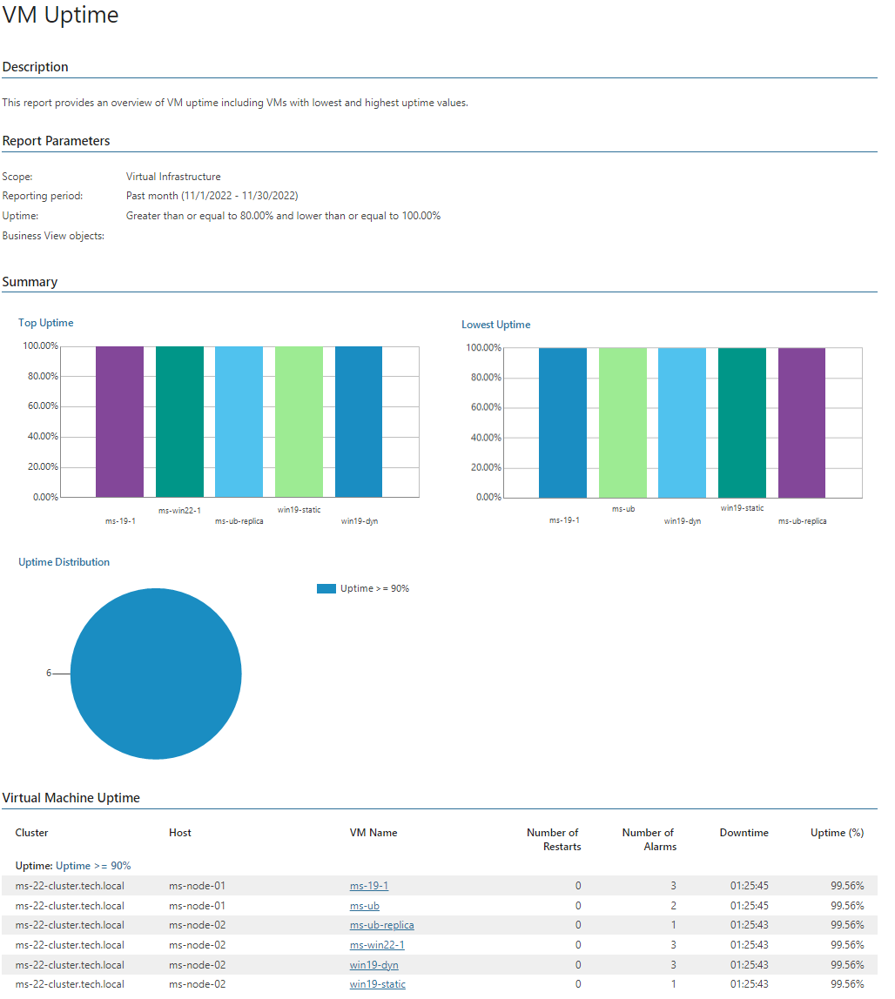

# VM Uptime (VMware Cloud Director)

This report analyzes VM uptime statistics to track VM uptime.

* The Summary section includes the following elements:

* The Top Uptime and Lowest Uptime charts display top 5 VMs in terms of the highest and the lowest uptime values.
* The Uptime Distribution chart displays the number of VMs with different uptime values.

* The Virtual Machine Uptime table provides the full list of VMs whose uptime values are lower and greater than the specified thresholds.

Report Parameters

You can specify the following report parameters:

* Infrastructure objects: defines a virtual infrastructure level and its sub-components to analyze in the report.
* Business View objects: defines Business View groups to analyze in the report. The parameter options are limited to objects of the Virtual Machine type.

Business View groups from the same category are joined using Boolean OR operator, Business View groups from different categories are joined using Boolean AND operator. That is, if you select groups from the same category, the report will contain all objects that are included in groups. However, if you select groups from different categories, the report will contain only objects that are included in all selected groups.

* Period: defines the time period to analyze in the report. Note that the reporting period must include at least one successfully completed Object properties data collection task for the selected scope. Otherwise, the report will contain no data.
* Uptime, greater than: defines the desired minimum uptime value.
* Uptime, less than: defines the desired maximum uptime value.

Use Case

Uptime is a measure of time a VM has been up and actively running on a host. When a VM is not operating, storage space allocated to it is not being used productively. Use this report to track uptime of virtualized workloads.

