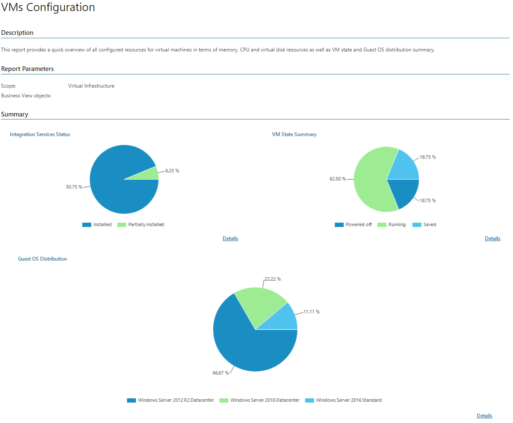

# VMs Configuration (Hyper-V)

This report documents the current configuration of VMs in the virtual infrastructure.

* The Summary section includes the following elements:

+ The Integration Services Status chart illustrates the status of Integration Services running on VMs.

Click the Details link at the bottom of the chart to drill down to the list of VMs and statuses of Integration Services running on these VMs.

* The VM State Summary chart illustrates the VM power state.

Click the Details link at the bottom of the chart to drill down to the list of VMs and their power states.

* The Guest OS Distribution chart illustrates what guest OSes are installed on VMs, and shows the share of a particular guest OS.

Click the Details link at the bottom of the chart to drill down to the list of guest OSes present in the infrastructure and the list of VMs on which these guest OSes are installed.

* The Details table provides detailed information for every VM, including data on VM location, computer name, guest OS type, number of vCPUs, memory type, amount of allocated memory resources, amount of allocated and used storage resources.

Report Parameters

You can specify the following report parameters:

* Infrastructure objects: defines a virtual infrastructure level and its sub-components to analyze in the report.
* Business View objects: defines Business View groups to analyze in the report. The parameter options are limited to objects of the Virtual Machine type.

Business View groups from the same category are joined using Boolean OR operator, Business View groups from different categories are joined using Boolean AND operator. That is, if you select groups from the same category, the report will contain all objects that are included in groups. However, if you select groups from different categories, the report will contain only objects that are included in all selected groups.

Use Case

The report helps administrators assess configuration properties of VMs in the monitored virtual infrastructure.

