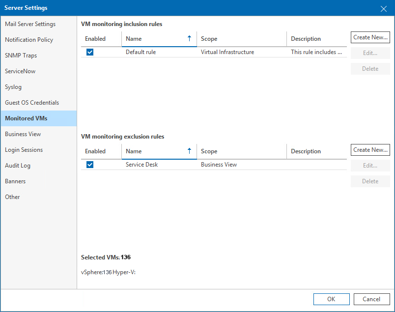

# Monitored VMs

On the Monitored VMs tab, you can manage the list of VMs and VM containers (hosts, clusters, datastores and so on) that must be included in the monitoring and reporting scope.

To choose what VMs and VM containers must be included in the monitoring and reporting scope:

1. Open Veeam ONE Client.

For details, see [Accessing Veeam ONE Components](access.md).

1. In the main menu, click Settings > Server Settings.

Alternatively, press [CTRL + S] on the keyboard.

1. In the Server Settings window, open the Monitored VMs tab.
2. Create rules that will be used to include VMs and VM containers to and exclude VMs and VM containers from monitoring and reporting.

For details on choosing objects to monitor and report on, see [Choosing VMs and VM Containers to Monitor and Report On](vms_to_monitor.md).

