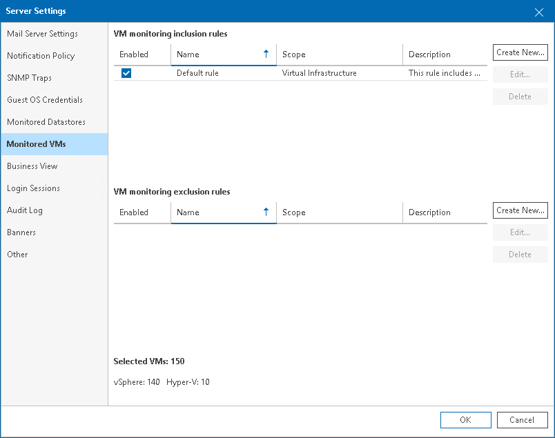
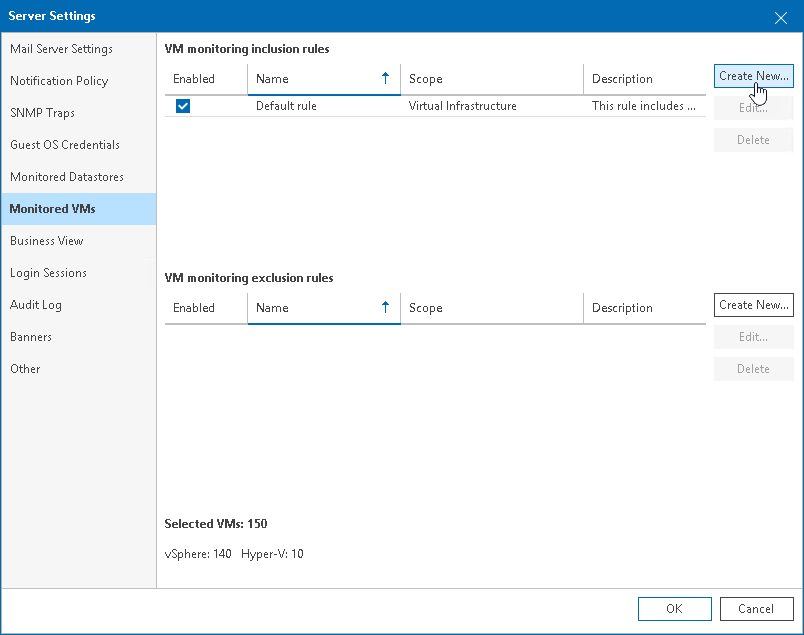
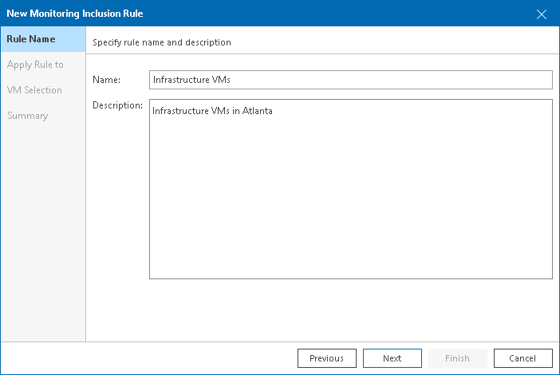
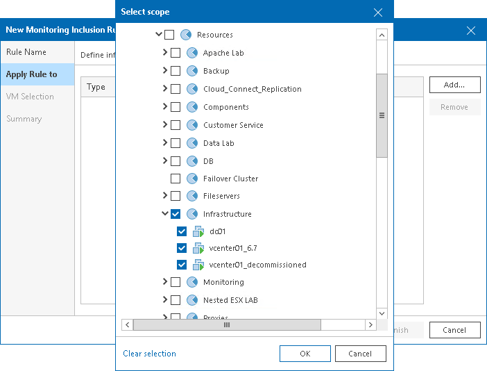
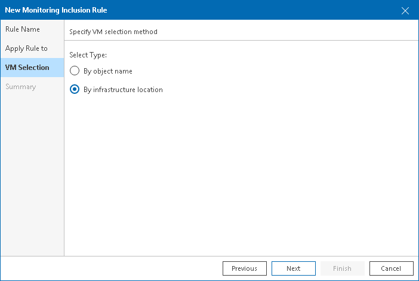
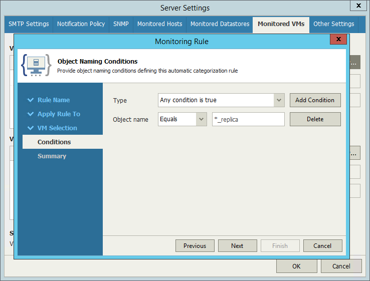

# Choosing VMs and VM Containers to Monitor and Report On

By default, Veeam ONE collects data about all VMs and VM containers (hosts, clusters, datastores and so on) on connected virtualization servers. If you do not want to monitor and report on specific VMs or VM containers, you can configure rules to include and exclude VMs and VM containers from the data collection scope.

You can refine the data collection scope with the following types of rules:

* Inclusion rules define VMs and VM containers that must be monitored and reported on. Out-of-the-box, Veeam ONE includes a default inclusion rule that adds to the data collection scope all VMs and VM containers on connected servers.
* Exclusion rules define VMs and VM containers that must not be monitored and reported on.

|  |
| --- |
| Note: |
| If you exclude all child objects of a container from monitoring, Veeam ONE will not collect monitoring and reporting data for the parent container. |

To configure an inclusion or exclusion rule, perform the following steps.

Step 1. Disable or Delete the Default Inclusion Rule

If you want to create one or more VM inclusion rules, you must delete or disable the default inclusion rule. Otherwise Veeam ONE will keep collecting data about all VMs and VM containers.

|  |
| --- |
| Note: |
| This step is not required if you want to create exclusion rules only. |

To delete or disable the default inclusion rule:

1. Open Veeam ONE Client.
2. In the main menu, click Settings and select Server Settings.

Alternatively, press the [CTRL+S] on the keyboard.

1. In the Server Settings window, open the Monitored VMs tab.
2. In the VM Monitoring Inclusion Rules section, delete or disable the default inclusion rule:

* To disable the default inclusion rule, clear the Enabled check box next to the rule.
* To delete the default inclusion rule, select the rule and click Delete on the right.

Step 2. Launch the Monitoring Rule Wizard

Launch the Monitoring Rule wizard:

* To create an inclusion rule, in the VM Monitoring Inclusion Rules section, click Create New.
* To create an exclusion rule, in the VM Monitoring Exclusion Rules section, click Create New.

Step 3. Specify Rule Name and Description

At the Rule Name step of the wizard, specify a name and description for the new rule.

Step 4. Add Objects to the Rule

At the Apply Rule to step of the wizard, specify the scope of the virtual infrastructure to which the rule must apply:

1. Click Add and select Infrastructure View, Business View or VMware Cloud Director View.
2. In the Select scope window, select check boxes next to VM containers to which the rule must apply.
3. Click OK.

Step 5. Choose VM Selection Criterion

At the VM Selection step, choose a criterion according to which VMs and VM containers must be added to the rule:

* By object name — select this option if you want to add VMs to the rule based on VM names.
* By infrastructure location — select this option if you want to add to the rule VMs that belong to a specific level of the virtual infrastructure hierarchy (the level you specified at the Apply Rule to step of the wizard).

You can use this selection criterion to find VMs that belong to a specific cluster, host, datastore or other VM container in the virtual infrastructure hierarchy.

Step 6. Specify Rule Conditions

The Conditions step of the wizard appears only if you have selected the By object name option at the VM Selection step. At this step, configure conditions for adding VMs to the rule by name:

1. Click Add Condition.
2. From the Object name list, select a condition for adding VMs — Equals or Not Equals.
3. In the field next to the selected condition, specify the name of VMs to add to the rule.

You can use the ‘\*’ (asterisk) and ‘?’ (question mark) wildcards. The ‘\*’ (asterisk) character stands for zero or more characters. The ‘?’ (question mark) stands for a single character. For example, if you want to find VM replicas created with Veeam Backup & Replication, you can create a rule with the ‘\*\_replica’ name query.

1. If you add two or more conditions, link them with Boolean operators. From the Type list, select a Boolean operator to link the conditions:

* Any condition is true — if at least one of the specified conditions is met, a VM will be added to the rule.
* All conditions are true — if all specified conditions are met, a VM will be added to the rule.

Step 7. Review the Configuration

At the Summary step, review the rule configuration and click Finish to exit the wizard.

