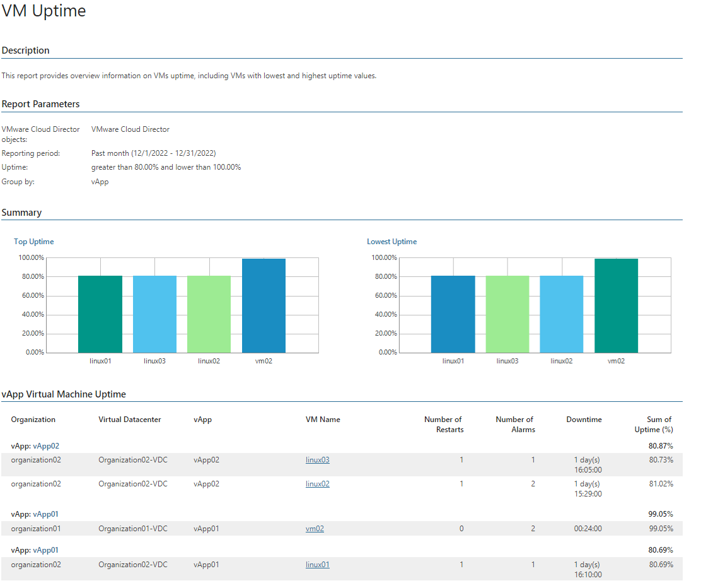

# VM Uptime (Hyper-V)

This report analyzes VM uptime statistics to track VM availability.

* The Top Uptime and Lowest Uptime charts display top 5 VMs in terms of the highest and the lowest uptime values.

* The vApp Virtual Machine Uptime table provides the full list of VMs whose uptime values are lower and greater than the specified thresholds.

Report Parameters

You can specify the following report parameters:

* VMware Cloud Director objects: defines a list of organizations to analyze in the report.
* Period: defines the time period to analyze in the report.
* Uptime, greater than: defines the desired minimum uptime value.
* Uptime, less than: defines the desired maximum uptime value.
* Group by: defines how data will be grouped in the report output (by Organization, Organization VDC, Uptime, vApp).

Use Case

Uptime is a measure of time a VM has been up and actively running on a host. When a VM is not operating, cloud space allocated to it is not being used productively. Use this report to track uptime of virtualized workloads.

