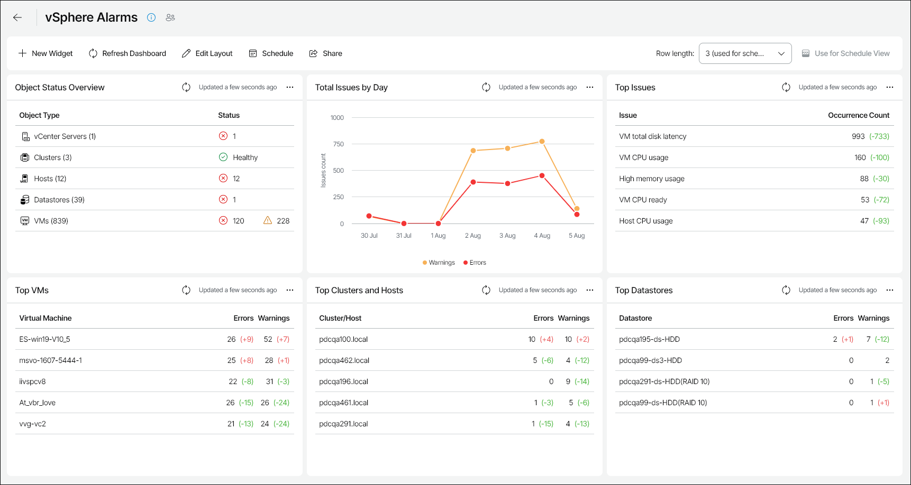

# vSphere Alarms

The vSphere Alarms dashboard provides an overview of alarms triggered by Veeam ONE Client during the past week. The dashboard allows you to identify the most typical issues that occur in your environment and to simplify troubleshooting.

You can access the vSphere Trends dashboard from the Dashboard tab in Veeam ONE Web Client.

Widgets Included

Object Status Overview

This widget shows the number of healthy objects, objects with warnings and objects with errors for each infrastructure component type.

Total Issues by Day

This widget displays the daily number of warnings and errors that were triggered during the week.

Top Issues

This widget provides a list of 5 most typical alarms in your environment and shows the number of times each alarm was triggered.

Values in parentheses show how the alarm repeat count has changed over the previous week\*.

Top VMs

This widget provides a list of VMs with the highest number of registered errors and warnings.

Values in parentheses show how the number of alarms has changed over the previous week\*.

Top Clusters and Hosts

This widget provides a list of virtual infrastructure objects (clusters and hosts) with the highest number of registered errors and warnings.

Values in parentheses show how the number of alarms has changed over the previous week\*.

Top Datastores

This widget provides a list of datastores with the highest number of registered errors and warnings.

Values in parentheses show how the number of alarms has changed over the previous week\*.

\*The value in parentheses stands for the amount by which the number of alarms has changed compared to the value of the previous week. For example, the 11 (+5) value means that the number of alarms has increased by 5 over the past week (while the previous value equaled 6), and the 11(-7) value means that the number of alarms has decreased by 7 (while the previous value equaled 18).

