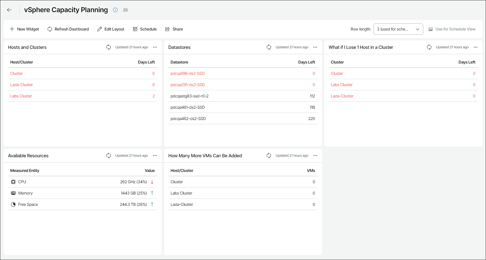

# vSphere Capacity Planning

The vSphere Capacity Planning dashboard helps you analyze performance of virtual infrastructure objects, forecast resource shortages, optimize resource provisioning and maintain high availability for VMware clusters.

You can access the vSphere Capacity Planning dashboard from the Dashboard tab in Veeam ONE Web Client.

Widgets Included

To estimate future resource utilization and forecast resource shortages, the dashboard analyzes historical performance data for the previous 90 days and calculates the performance utilization trend.

Hosts and Clusters

The widget forecasts how many days remain before hosts and clusters start experiencing resource shortages, given the performance utilization trend. The widget analyzes CPU, memory, storage space and storage I/O performance data.

The days left value is highlighted with red if the number of remaining days is less than 30. The infinity sign implies that a host or a cluster will not run out of CPU and memory resources in the foreseeable future.

Datastores

The widget forecasts how many days remain before datastores will run out of free space, given the performance utilization trend.

The days left value is highlighted with red if the number of remaining days is less than 30. The infinity sign implies that a datastore will not run out of free space in the foreseeable future.

What if I Lose 1 Host in a Cluster

A host may unexpectedly go down or enter a maintenance mode, which will increase workloads across failover hosts in a cluster. The widget simulates a failure of one host in a HA cluster and forecasts how many days remain before the cluster starts experiencing resource shortages.

The days left value is highlighted with red if the number of remaining days is less than 30. The infinity sign implies that a cluster will not run out of CPU and memory resources in the foreseeable future.

Available Resources

The widget shows the amount of available CPU, memory and storage resources for the previous week.

The number in parentheses represents available resources as a percentage of total physical resources.

Arrows on the right show whether the amount of CPU, memory and free space has changed since the previous day. For example, a green arrow pointing up next to the Free Space value means that the available storage space has increased since yesterday, while a red arrow pointing down next to the CPU value means that the amount of available CPU resources has decreased since yesterday.

How Many More VMs Can Be Added

The widget analyzes the current workload, assesses average VM configuration in your clusters and hosts, and calculates the number of additional VMs with the average configuration that your existing infrastructure can support without experiencing significant resource shortages.

