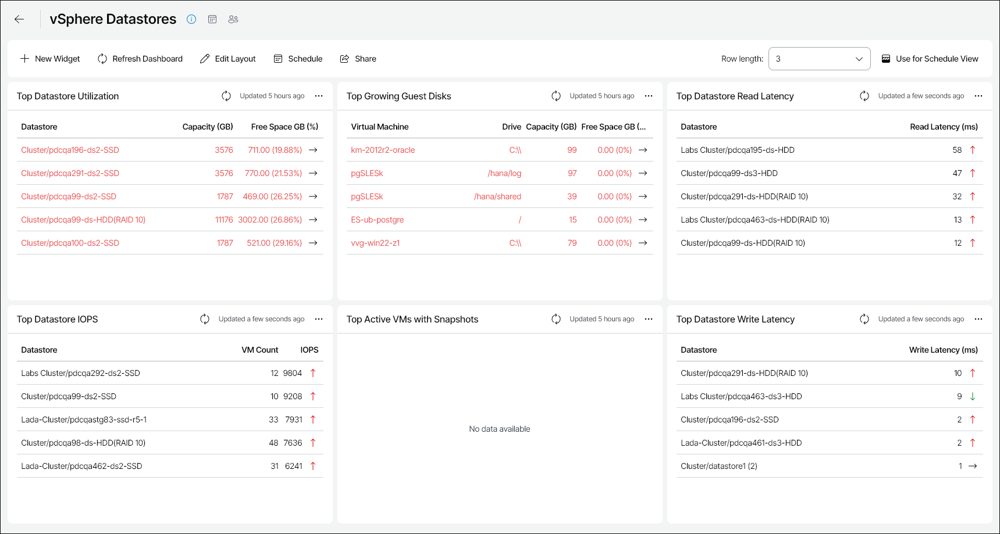

# vSphere Datastores

The vSphere Datastores dashboard is designed to provide at-a-glance view on resource usage and performance of datastores in the VMware vSphere infrastructure. The dashboard helps you assess disk capacities and prevent potential performance bottlenecks.

You can access the vSphere Datastores dashboard from the Dashboard tab in Veeam ONE Web Client.

Widgets Included

Top Datastore Utilization

This widget displays a list of datastores that will run out of free space sooner than other datastores.

A datastore is highlighted with red if the amount of free space is less than 50% of the capacity value.

Values in parentheses show free space values for the previous week.

Arrows on the right show how the amount of free space has changed over the previous week\*.

Top Growing Guest Disks

This widget displays a list of VMs with the least amount of free guest disk space. For each VM in the list, the widget provides information on the logical disk volume and total capacity.

A disk is highlighted with red if the amount of free space is less than 50% of the capacity value.

Values in parentheses show free space values for the previous week.

Arrows on the right show how the amount of free space has changed over the previous week\*.

Top Datastore Read Latency

This widget displays a list of datastores with the highest average Read Latency metric values.

Arrows on the right show how the average read latency value has changed over the previous week\*.

Top Datastore IOPS

This widget displays a list of datastores with the highest number of IOPS. For each datastore in the list, the widget provides the total number of VMs residing on the datastore.

Arrows on the right show how the number of IOPS has changed over the previous week\*.

Top Active VMs with Snapshots

This widget displays a list of VMs with the largest snapshots. For each VM in the list, the widget provides the name of the datastore where the VM snapshots are located.

A VM is highlighted with red if the total size of all VM snapshots is greater than 20% of the VM size.

Top Datastore Write Latency

This widget displays a list of datastores with the highest Write Latency metric values.

Arrows on the right show how the average write latency value has changed over the previous week\*.

\*The arrows allow you to compare the results of this week to the results of the previous week, and to track how the trend has evolved. For example, a grey arrow pointing right next to the Write Latency value means that the average latency has not changed over the past week, a green arrow pointing down means that the average latency has decreased, while a red arrow pointing up means that the average latency has increased.

