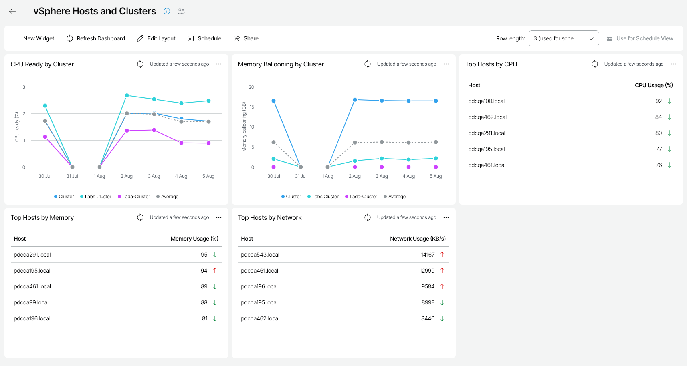

# vSphere Hosts and Clusters

The vSphere Hosts and Clusters dashboard helps you evaluate host and cluster performance in your VMware vSphere infrastructure. The dashboard displays statistics on CPU, memory and network utilization, and helps you identify hosts and clusters with performance issues.

You can access the vSphere Hosts and Clusters dashboard from the Dashboard tab in Veeam ONE Web Client.

Widgets Included

CPU Ready by Cluster

This widget shows how the average CPU ready time for all VMs on all hosts in the cluster has been changing during the week.

Memory Ballooning by Cluster

This widget shows how the amount of memory processed by the VM memory control driver for all VMs on all hosts in the cluster has been changing during the week.

Top Hosts by CPU

This widget displays weekly CPU utilization data for the top 5 most loaded hosts in your infrastructure.

Arrows on the right show how the average CPU usage value has changed over the previous week\*.

Top Hosts by Memory

This widget displays a list of hosts with the highest level of memory consumption.

Arrows on the right show how the average memory usage value has changed over the previous week\*.

Top Hosts by Network

This widget displays a list of hosts with the highest level of network usage.

Arrows on the right show how the average network throughput value has changed over the previous week\*.

\*The arrows allow you to compare the results of this week to the results of the previous week, and to track how the trend has evolved. For example, a grey arrow pointing right next to the CPU Usage value means that CPU utilization has not changed over the past week, a green arrow pointing down means that CPU utilization has decreased, while a red arrow pointing up means that CPU utilization has increased.

