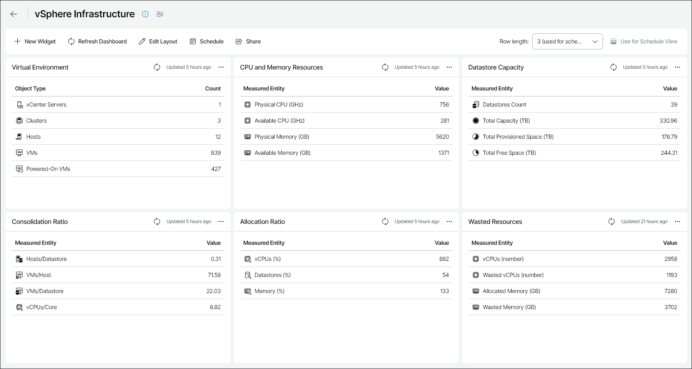

# vSphere Infrastructure

The vSphere Infrastructure dashboard is designed to provide at-a-glance view of configuration of the VMware vSphere infrastructure and to help you assess the overall performance and resource usage efficiency.

You can access the vSphere Infrastructure dashboard from the Dashboard tab in Veeam ONE Web Client.

Widgets Included

Virtual Environment

This widget shows the total number of vCenter servers, clusters, ESXi hosts and VMs in your environment, as well as the number of currently running VMs.

CPU and Memory Resources

This widget assesses physical CPU and memory resources installed on ESXi hosts and shows the amount of available resources allocated to VMs.

Datastore Capacity

This widget provides information on the number of datastores in your environment, their total capacity, the amount of provisioned and free space left on the datastores.

Consolidation Ratio

The widget tracks the amount of virtual hardware placed on physical hardware:

* Hosts/Datastore ratio shows the average number of hosts connected to a single datastore.
* VMs/Host ratio shows the average number of VMs running on a single physical host.
* VMs/Datastore ratio shows the average number of VMs that store data on a single datastore.
* vCPUs/Core ratio shows the average number of virtual processors operating on a single physical CPU core.

Allocation Ratio

The widget tracks the amount of virtual and physical resources allocated to VMs:

* vCPU allocation ratio shows the number of virtual processors operating on a single physical CPU core (in percentage).
* Datastores allocation ratio shows the amount of datastore space allocated to VMs (in percentage).
* Memory allocation ratio shows the amount of physical RAM allocated to VMs (in percentage).

Wasted Resources

The widget tracks the amount of over-provisioned resources in your environment, based on data gathered by the [Oversized VMs](oversized_vms_vmware.md) report:

* vCPU value shows the total number of provisioned vCPUs.
* vCPU Wasted value shows the total number of over-provisioned vCPUs. Use this value as a measure of compute resources that you can reclaim and allocate to other VMs.
* Allocated Memory value shows the total amount of provisioned virtual memory.
* Memory Wasted value shows the amount of over-provisioned virtual memory. Use this value as a measure of compute resources that you can reclaim and allocate to other VMs.

