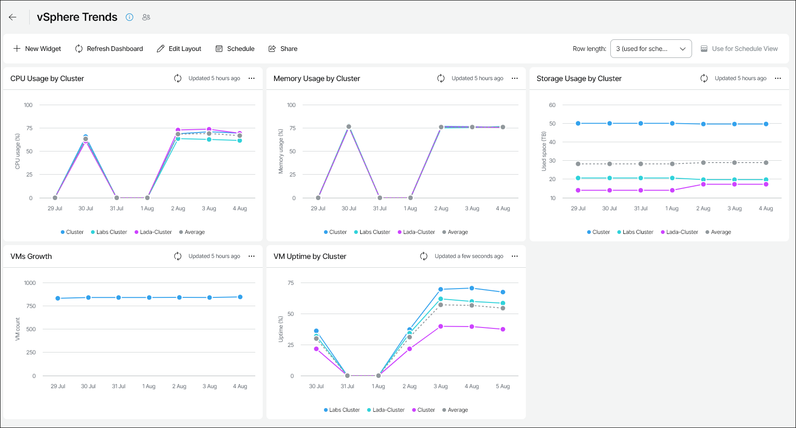

# vSphere Trends

The vSphere Trends dashboard helps you track resource utilization in your VMware vSphere infrastructure by displaying growth trends for the previous week.

You can access the vSphere Trends dashboard from the Dashboard tab in Veeam ONE Web Client.

Widgets Included

CPU Usage by Cluster

This widget shows how CPU utilization in a cluster has been changing during the week.

Memory Usage by Cluster

This widget shows how memory utilization in a cluster has been changing during the week.

Storage Usage by Cluster

This widget shows how storage utilization in a cluster has been changing during the week.

VMs Growth

This widget shows how the number of VMs in your virtual infrastructure has been changing during the week.

VM Uptime by Cluster

This widget shows how the average uptime value for VMs in a cluster has been changing during the week.

