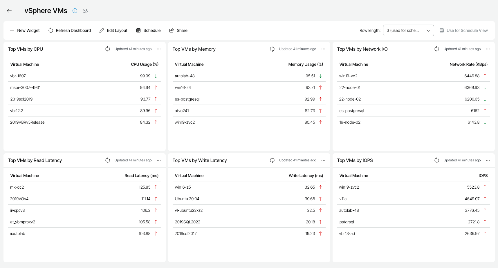

# vSphere VMs

The vSphere VMs dashboard provides information about health and performance of VMs in the VMware vSphere infrastructure, and shows general VM statistics on CPU, memory and network usage for the past week.

You can access the vSphere VMs dashboard from the Dashboard tab in Veeam ONE Web Client.

Widgets Included

Top VMs by CPU

This widget displays a list of VMs with the highest average level of CPU utilization.

Arrows on the right show how the CPU usage value has changed over the previous week\*.

Top VMs by Memory

This widget displays a list of VMs with the highest average level of memory utilization. The memory utilization value is calculated as a percentage of total memory allocated for the VM.

Arrows on the right show how the memory utilization value has changed over the previous week\*.

Top VMs by Network I/O

This widget displays a list of VMs with the highest average network throughput values.

Arrows on the right show how the throughput value has changed over the previous week\*.

Top VMs by Read Latency

This widget displays a list of VMs with the highest average Read Latency metric values.

Arrows on the right show how the average read latency value has changed over the previous week\*.

Top VMs by Write Latency

This widget displays a list of VMs with the highest average Write Latency metric values.

Arrows on the right show how the average write latency value has changed over the previous week\*.

Top VMs by IOPS

This widget displays a list of VMs with the highest average number of IOPS.

Arrows on the right show how the number of IOPS has changed over the previous week\*.

\*The arrows allow you to compare the results of this week to the results of the previous week, and to track how the trend has evolved. For example, a grey arrow pointing right next to the CPU Usage value means that CPU utilization has not changed over the past week, a green arrow pointing down means that CPU utilization has decreased, while a red arrow pointing up means that CPU utilization has increased.

