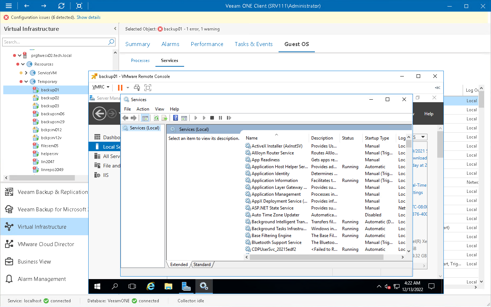

# VMware Remote Console (VMRC)

You can access the VMware Remote Console (VMRC) right from the Veeam ONE Client interface. From within the VMware Remote Console, you can isolate the root cause of VM performance problems and perform management tasks — for example, restart an unresponsive VM.

This option requires no additional software installed on the Veeam ONE server and is available for both Window-based and Linux-based OS’s.

|  |
| --- |
| Note: |
| VMware Remote Console is not included as part of Veeam ONE and Veeam Backup & Replication installation and must be installed separately. For details on VMware Remote Console, see [Install the VMware Remote Console Application](https://docs.vmware.com/en/VMware-vSphere/7.0/com.vmware.vsphere.vm_admin.doc/GUID-38040DA5-2700-4D3F-8D7C-9996CCD6B2C7.html). |

Accessing VMware Remote Console

To access the VMware Remote Console:

1. Open Veeam ONE Client.

For details, see [Accessing Veeam ONE Components](access.md).

1. At the bottom of the inventory pane, click Virtual Infrastructure.
2. In the inventory pane, right-click the necessary VM and select Open Console from the shortcut menu.

You can use buttons at the top of the VMware Remote Console to manage the VM and change its power state.

To connect to a VM or change the VM power state, you can also right-click the VM in the inventory pane and use one of the following shortcut menu commands:

* To access the VM using Windows Remote Desktop Connection, choose Remote Management > Connect to VM.
* To change the VM power state, choose Remote Management and choose the necessary command.

