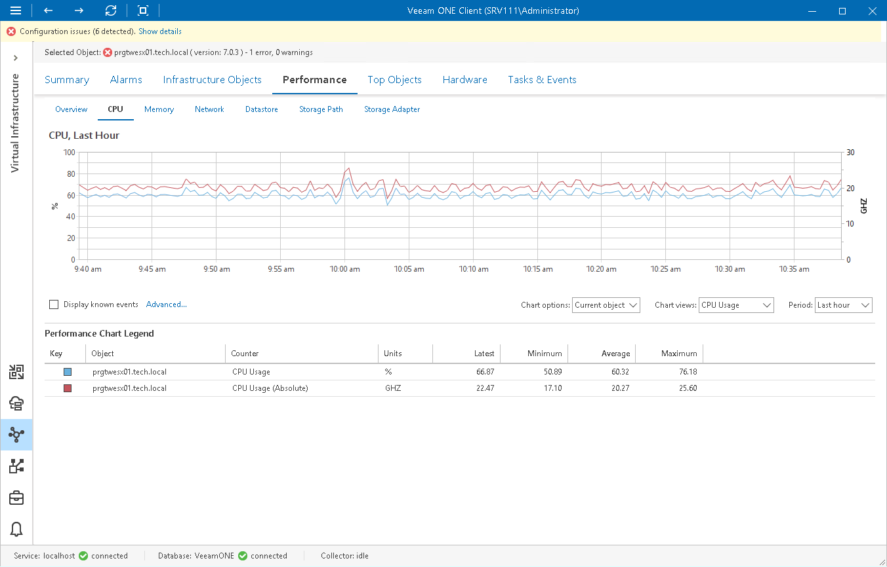

# CPU Performance Chart

The CPU chart displays historical statistics on CPU utilization for the selected infrastructure object.

|  |
| --- |
| Note |
| Performance statistics for VMs are gathered and displayed from the VMware vSphere environment and not from within the Guest OS. This is because the guest OS is unaware of the hypervisor's resource allocations and cannot recognize when the hypervisor temporarily de-schedules VM resources during periods of inactivity. |

Host

The following table provides information on predefined views and counters that apply to hosts.

Host

| Chat View | Counter | Measurement Unit | Description |
| CPU Usage | CPU Usage | Percent | CPU actively used on a host, as a percentage of total available CPU. |
| CPU Usage (Absolute) | GHZ | Sum of actively used CPU for all powered on VMs on a host. |
| CPU Bottlenecks | Average CPU Ready | Percent | Average CPU Ready value for all VMs on a host. |

Virtual Machine

The following table provides information on predefined views and counters that apply to VMs.

Virtual Machine

| Chat View | Counter | Measurement Unit | Description |
| CPU Usage | CPU Usage | Percent | Amount of actively used virtual CPU resources, as a percentage of total available CPU (this is the host view, not the guest OS view). |
| CPU usage (Absolute) | GHZ | Amount of actively used virtual CPU resources (this is the host view, not the guest OS view). |
| CPU Bottlenecks | Average CPU Idle All cores | Percent | Average amount of time all CPU cores spent in an idle state. |
| Average CPU Ready All cores | Percent | Average CPU Ready value across all cores on a host. |
| Average CPU Standstill All cores | Percent | Average amount of time all CPU cores spent in a standstill state. |
| Average CPU Wait All cores | Percent | Time spent waiting for hardware or VMKernel lock thread locks. |
| CPU Co-stop all cores | Percent | Average amount of time a VM was ready but unable to run due to co-scheduling constraints. |

For objects that are parent to ESXi hosts and VMs, Veeam ONE displays rollup values.

