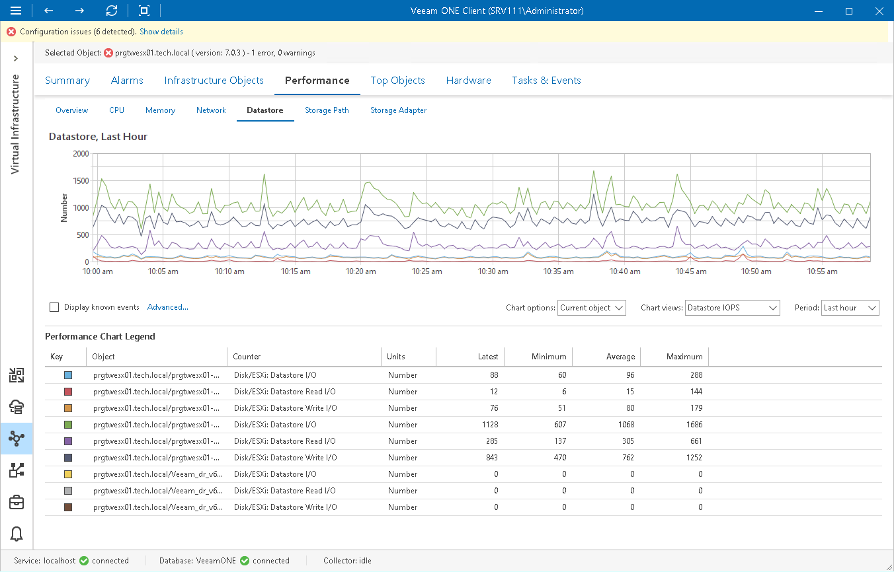

# Datastore Performance Chart

The Datastore chart displays historical statistics for all datastores (including vSAN datastores) used by the selected infrastructure component and its child objects.

Host

The following table provides information on predefined views and counters that apply to hosts.

Host

| Chart View | Counter | Measurement Unit | Description |
| Datastore IOPS | Disk/ESXi: Datastore I/O | Number | Aggregate number of I/O operations on a datastore. |
| Disk/ESXi: Datastore Read I/O | Number | Average number of read commands per second to a datastore. |
| Disk/ESXi: Datastore Write I/O | Number | Average number of write commands per second to a datastore. |
| Datastore Usage Rates | Disk/ESXi: Datastore Read Rate | MB/s | Rate at which data is read from a datastore. |
| Disk/ESXi: Datastore Usage | MB/s | Sum of read and write rates to a datastore. |
| Disk/ESXi: Datastore Write Rate | MB/s | Rate at which data is written to a datastore. |
| Datastore Latency | Disk/ESXi: Datastore Highest Latency | Millisecond | Highest latency value across all datastores used by a host. |
| Disk/ESXi: Datastore Latency Observed by VMs | Millisecond | Average datastore latency as seen by VMs. |
| Disk/ESXi: Datastore Read Latency | Millisecond | Average amount of time that a read from the datastore takes. |
| Disk/ESXi: Datastore Write Latency | Millisecond | Average amount of time that a write operation to a datastore takes. |
| Datastore Issues | Disk/ESXi: Datastore Bus Resets | Number | Number of SCSI bus reset commands. |
| Disk/ESXi: Datastore Command Aborts | Number | Number of aborted SCSI commands. |
| Disk/ESXi: Datastore Maximum Queue Depth | Number | Number of outstanding requests to a storage device. |

Virtual Machine

The following table provides information on predefined views and counters that apply to VMs.

Virtual Machine

| Chart View | Counter | Measurement Unit | Description |
| Datastore IOPS | Datastore I/O | Number | Aggregate number of I/O operations on a datastore. |
| Datastore Read I/O | Number | Average number of read commands per second to a datastore. |
| Datastore Write I/O | Number | Average number of write commands per second to a datastore. |
| Disk/vSAN: Recovery Write I/O | Number | Average number of write commands per second to a vSAN datastore disk that contains copy of VM data. |
| Datastore Usage Rates | Datastore Read Rate | MB/s | Rate at which data is read from a datastore. |
| Datastore Usage | MB/s | Sum of read and write rates for a datastore. |
| Datastore Write Rate | MB/s | Rate at which data is written to a datastore. |
| Disk/vSAN: Recovery Write Rate | MB/s | Rate of writing data to a vSAN datastore disk that stores copy of VM data. |
| Datastore Latency | Datastore Highest Latency | Millisecond | Highest latency value across all datastores used by a host. |
| Datastore Read Latency | Millisecond | Average amount of time that a read operation from a datastore takes. |
| Datastore Write Latency | Millisecond | Average amount of time that a write operation to a datastore takes. |
| Disk/vSAN: Recovery Write Latency | Millisecond | Average amount of time that a write operation to a vSAN datastore disk storing copy of VM data takes. |
| Datastore Issues | Datastore Bus Resets | Number | Number of SCSI bus reset commands. |
| Datastore Command Aborts | Number | Number of aborted SCSI commands. |

For objects that are parent to ESXi hosts and VMs, Veeam ONE Monitor displays rollup values.
Charts for folders, clusters, datacenters, vCenter Servers display rollup values for all hosts in the container. Chart for a resource pool displays rollup values for all VMs in the resource pool.

Page updated 2026-07-30

