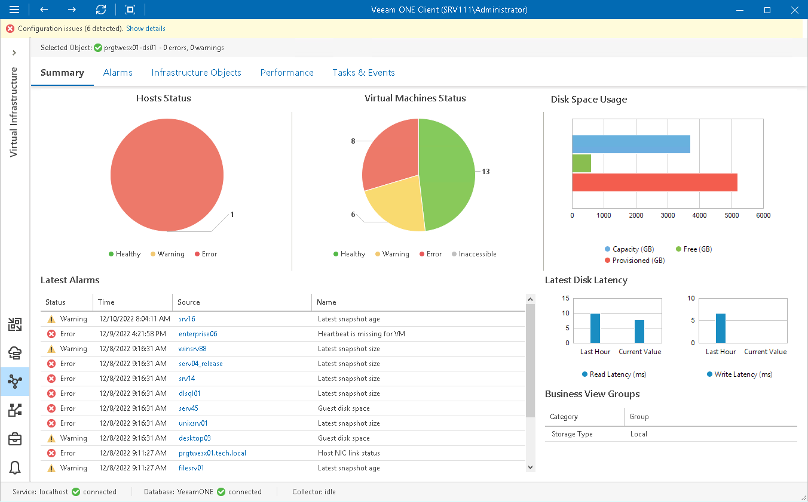

# Datastore Summary

The datastore summary dashboard provides the health status and performance overview for the selected datastore. In addition, it shows the status of objects that can affect the datastore performance — hosts that work with the datastore and VMs whose files reside on the datastore.

Hosts Status, Virtual Machines Status

The charts reflect the health status of hosts that work with the datastore and VMs whose files reside on the datastore.

Every chart segment represents the number of objects with a certain status — objects with errors (red), objects with warnings (yellow) and healthy objects (green). Click a chart segment or a legend label to drill down to the list of alarms with the corresponding status for hosts or VMs.

Disk Space Usage

The chart shows the amount of available, used and provisioned disk space on the datastore.

Latest Disk Latency

The section displays the current read and write latency values as well as the average latency values for the past hour.

Latest Alarms

The list displays the latest 15 alarms for the datastore and for objects that work with this datastore. Click a link in the Source column to drill down to the list of alarms for the selected object.

For more information, see [Working with Triggered Alarms](triggered_alarms.md).

Business View Groups

The section displays the list of categories and groups to which the datastore is included.

Page updated 2026-07-31

