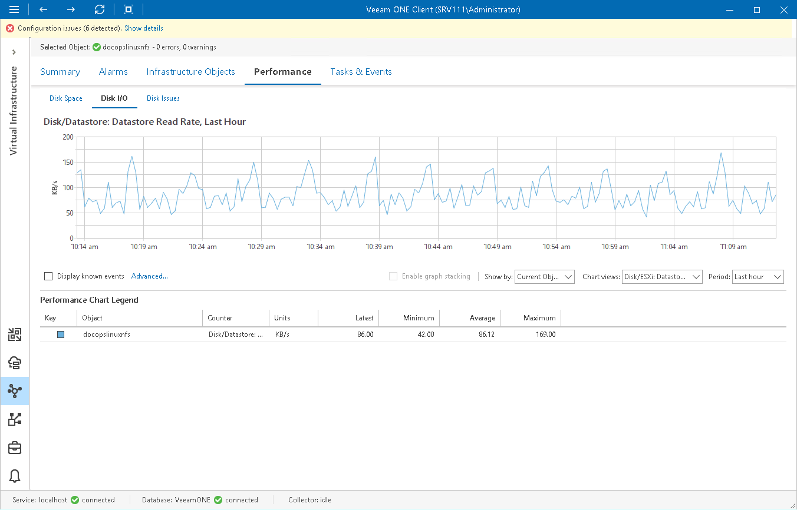

# Disk I/O Chart

The Disk I/O chart is available for datastores and datastore clusters. It displays historical statistics on the read and write load.

Use the Chart options list to display graphs for the current object (for example, a specific datastore or a virtual infrastructure container), for VMs or hosts that work with the selected datastore. For VMs or for hosts, this chart displays stacked graphs to let you see actual cumulative load on a particular datastore. If you choose to view the chart for the top Datastore parent object, you will also be able to stack graphs by all available datastores.

The following table provides information on predefined views and counters.

Disk I/O Chart

| Chart View | Measurement Unit | Description |
| Disk/ESXi: Datastore Read Rate | MB/s | Rate at which data is read from a datastore. |
| Disk/ESXi: Datastore Write Rate | MB/s | Rate at which data is written to a datastore. |
| Disk/ESXi: Datastore Usage | MB/s | Sum of read and write rates for a datastore. |
| Disk/ESXi: Datastore Read I/O | Number | Number of times data was read from the disk by all VMs residing on a datastore. |
| Disk/ESXi: Datastore Write I/O | Number | Number of times data was written to the disk by all VMs residing on a datastore. |
| Disk/ESXi: Datastore I/O | Number | Average number of commands issued per second to a storage device by the adapter. |
| Disk/ESXi: Datastore Read Latency | Millisecond | Average amount of time that a read operation from a datastore takes (from the perspective of an ESXi host). |
| Disk/ESXi: Datastore Write Latency | Millisecond | Average amount of time that a write operation to a datastore takes (from the perspective of an ESXi host). |

