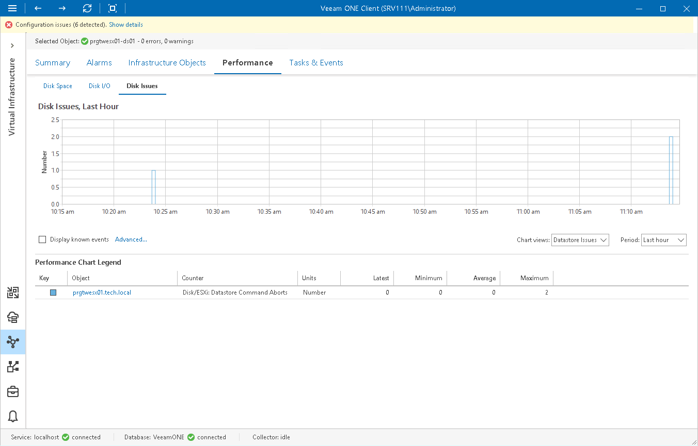

# Disk Issues Chart

The Disk Issues chart displays historical statistics on the number of disk bus resets and disk command aborts that have occurred in the defined interval. This chart is available for datastores and datastore clusters.

The following table provides information on predefined views and counters.

Disk Issues Chart

| Chart View | Measurement Unit | Counter | Description |
| Datastore Issues | Disk/ESXi: Datastore Bus Resets | Number | Number of aborted SCSI commands. |
| Disk/ESXi: Datastore Command Aborts | Number | Number of SCSI bus reset commands. |

