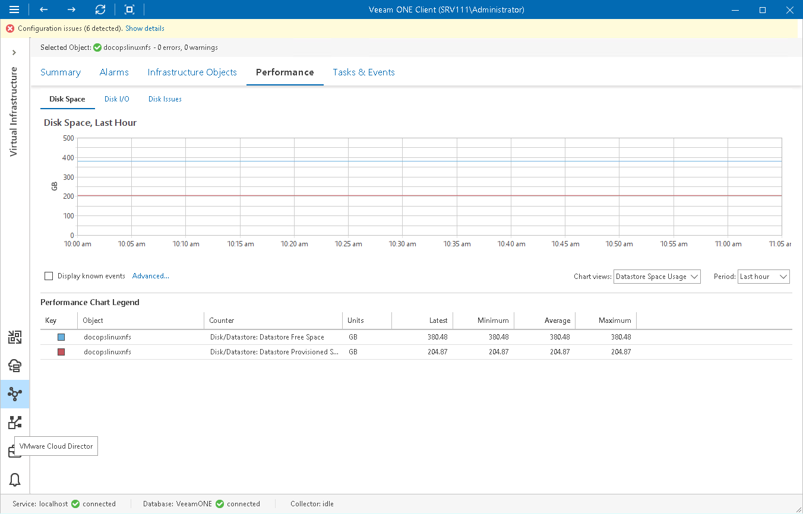

# Disk Space Chart

The Disk Space chart is available for datastores and datastore clusters. It displays historical statistics on disk space resources and usage for the selected datastore or datastore cluster.

The following table provides information on predefined views and counters.

Disk Space Chart

| Chart View | Counter | Measurement Unit | Description |
| Datastore Space Usage | Disk/Datastore: Datastore Free Space | TB/GB | Amount of free space on a datastore. |
| Disk/Datastore: Datastore Provisioned Space | TB/GB | Amount of storage allocated for a datastore. Size of files on the datastore cannot exceed this value. |

