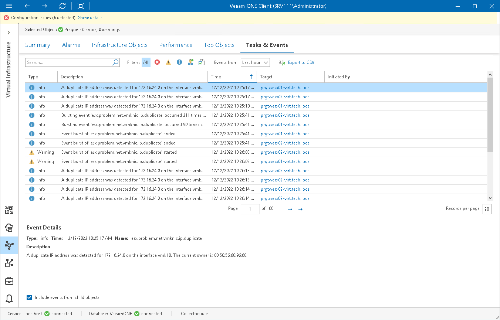

# VMware vSphere Tasks & Events

You can view information about tasks and events that occur in the virtual environment within the selected time interval. Veeam ONE loads tasks and events from vCenter Server. For each loaded task, it creates two events — one informs you when the task starts and the other informs you when the task ends.

To view the list of tasks and events:

1. Open Veeam ONE Client.

For details, see [Accessing Veeam ONE Components](access.md).

1. At the bottom of the inventory pane, click Virtual Infrastructure.
2. In the inventory pane, select the necessary infrastructure object.
3. Open the Tasks & Events tab.
4. The Tasks & Events list can display up to 1000 tasks and events at a time. To find the necessary task or event, you can use the following controls:

* To display tasks or events for a specific period, select the necessary time interval from the Events from list.
* To show or hide tasks or events, use filter buttons at the top of the list — Show all events, Show errors, Show warnings, Show info messages, Show user events, Show tasks.
* To find the necessary tasks or events by description, use the Search field at the top of the list.

1. To view the detailed description of an event, click it in the Tasks & Events list.

The event description will be shown in the Event Details pane at the bottom.

When you choose a virtual infrastructure container in the inventory pane, you can view events for the selected object and events for its child objects. To hide events related to child objects, clear the Include events from child objects check box at the bottom of the Event Details section.

1. To export displayed events to a CSV file, click Export to CSV at the top of the list and specify the location where the file will be saved.

For every task or event in the list, the following details are available:

* Event type (User, Task, Info, Warning or Error)
* Short description
* Time of occurrence
* Object to which the task or event relates
* Object or user that caused or initiated the event

Related Topics

[Viewing Events on Performance Charts](view_vsphere_events_in_charts.md)

