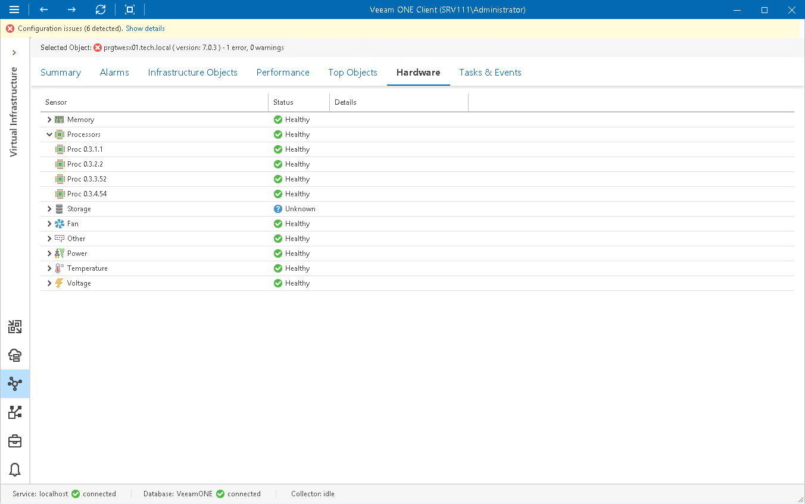

# Host Hardware State

You can monitor the health of ESXi host hardware components. Veeam ONE collects sensor details for chassis, memory, power, processors, software components, storage, system, watchdog, fan, temperature, voltage and other components.

To monitor the health status of host hardware components:

1. Open Veeam ONE Client.

For details, see [Accessing Veeam ONE Components](access.md).

1. At the bottom of the inventory pane, click Virtual Infrastructure.
2. In the inventory pane, select the necessary host.
3. Open the Hardware tab.

The color of the status indicator changes depending on the state of the corresponding component for a standalone host and on the status of a triggered vCenter Server alarm:

* Green — the subsystem is functioning properly.
* Yellow and Red — the performance threshold is exceeded, performance has gone down or the subsystem has stopped operating.

