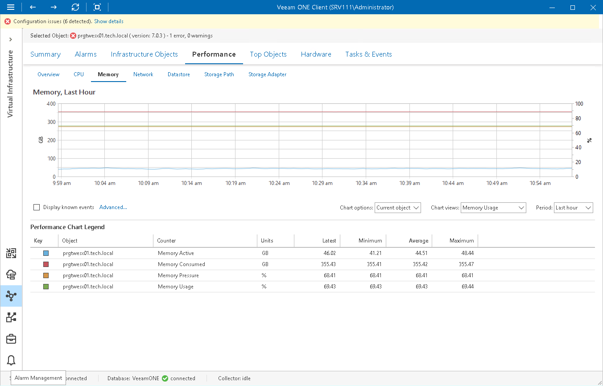

# Memory Performance Chart

The Memory chart displays historical statistics on memory utilization for the selected infrastructure object.

|  |
| --- |
| Note |
| Performance statistics for VMs are gathered and displayed from the VMware vSphere environment and not from within the Guest OS. This is because the guest OS is unaware of the hypervisor's resource allocations and cannot recognize when the hypervisor temporarily de-schedules VM resources during periods of inactivity. |

Host

The following table provides information on predefined views and counters that apply to hosts.

Host

| Chart View | Counter | Measurement Unit | Description |
| Memory Usage | Memory Active | GB | Sum of all active memory metrics for all powered-on VMs and vSphere services (such as COS, vpxa) on a host, as estimated by VMkernel based on recently touched memory pages. |
| Memory Consumed | GB | Amount of physical memory used on a host, including memory used by the Service Console, VMkernel, vSphere services and total memory consumed by running VMs. |
| Memory Pressure | Percent | Potential memory demand that is based on total allocated memory for running VMs, memory overhead, effects of memory Transparent Page Sharing and total available memory. |
| Memory Usage | Percent | Memory usage as percentage of available machine memory. |
| Memory Swap Rate | Memory Swap Used | B | Amount of memory swapped to disk: sum of memory swapped for all powered on VMs and vSphere services on a host. |
| Swap In Rate | B/s | Rate at which memory is swapped from disk into host active memory during the current interval. |
| Swap Out Rate | B/s | Rate at which memory is swapped from host active memory to disk during the current interval. |
| Memory Management | Memory Balloon | B | Amount of memory allocated by the VM memory control driver (vmmemctl). |
| Memory Compressed | B | Amount of RAM pages memory compressed by a host instead of swapping to disk. |
| Memory Overhead | B | Total amount of memory overhead metrics for all powered-on VMs, plus memory overhead of running vSphere services on a host. |
| Memory Sharing | Memory Shared | MB | Sum of memory shared metrics for all powered-on VMs, and memory consumed by vSphere services on a host. |
| Memory Shared Common | MB | Amount of memory shared by all powered-on VMs and vSphere services on a host. |
| Memory Latency | Memory Latency | Percent | Percentage of time a VM is waiting to access swapped or compressed memory. |

Virtual Machine

The following table provides information on predefined views and counters that apply to VMs.

Virtual Machine

| Chart View | Counter | Measurement Unit | Description |
| Memory Usage | Memory Active | GB | Amount of guest physical memory actively used, as estimated by VMkernel based on recently touched memory pages. |
| Memory Consumed | GB | Amount of guest physical memory consumed by a VM. The value includes the shared and memory that might be reserved but not actually used; overhead memory is not taken into account. |
| Memory Entitlement | GB | Amount of host physical memory a VM is entitled to, as determined by the ESXi scheduler. |
| Memory Usage | Percent | Memory usage as percentage of configured physical memory for a VM. |
| Memory Swap Rate | Memory Swapped | B | Amount of guest physical memory swapped out to the VM swap file by the VMkernel. The metrics refers to VMkernel swapping, not to guest OS swapping. |
| Swap In Rate | B/s | Rate at which memory is swapped from disk into active memory during the current interval. |
| Swap Out Rate | B/s | Rate at which memory is swapped from active memory to disk during the current interval. |
| Memory Management | Memory Balloon | MB | Amount of memory allocated by the VM memory control driver (vmmemctl). |
| Memory Compressed | MB | Amount of RAM pages compressed by a host instead of swapping to disk. |
| Memory Overhead | MB | Amount of machine memory used by VMkernel to run a VM. |
| Memory Saved by Zipping | MB | Amount of memory saved by memory zipping. |
| Memory Sharing | Memory Shared | B | Amount of guest physical memory that a VM shares with other virtual machines (through VMkernel Transparent Page Sharing and RAM deduplication). |
| Memory Latency | Memory Latency | Percent | Percentage of time a VM is waiting to access swapped or compressed memory. |

For objects that are parent to ESXi hosts and VMs, Veeam ONE Client displays rollup values.

