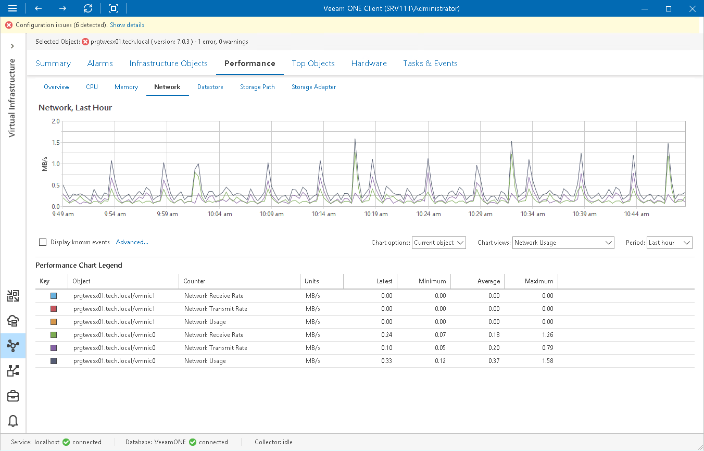

# Network Performance Chart

The Network chart displays historical statistics on network usage for the selected infrastructure object.

Host

The following table provides information on predefined views and counters that apply to hosts.

Host

| Chart View | Counter | Measurement Unit | Description |
| Network Usage | Network Receive Rate | KB/s | Rate at which data is received across each physical NIC instance on a host. The counter represents the bandwidth of the network. |
| Network Transmit Rate | KB/s | Rate at which data is transmitted across each physical NIC instance on a host. |
| Network Usage | KB/s | Network utilization, sum of data received and transmitted across all physical NIC instances connected to a host. |
| Network Transfer Rate (Packets) | Received Packets per Second | Number | Average number of packets received per second across each physical NIC instance on a host. |
| Transmitted Packets per Second | Number | Average number of packets transmitted per second across each physical NIC instance on a host. |
| Dropped and Error Packets | Packet Receive Errors | Number | Number of packets with errors received. |
| Packet Transmit Errors | Number | Number of packets with errors transmitted. |
| Receive Packets Dropped | Number | Number of receives dropped. |
| Total Errors | Number | Total number of packets with errors received and transmitted. |
| Total Packets Dropped | Number | Total number of dropped packets. |
| Transmit Packets Dropped | Number | Number of transmits dropped. |

Virtual Machine

The following table provides information on predefined views and counters that apply to VMs.

Virtual Machine

| Chart View | Counter | Measurement Unit | Description |
| Network Usage | Network Receive Rate | KB/s | Rate at which data is received across the vNIC instance on a VM. The counter represents the bandwidth of the network. |
| Network Transmit Rate | KB/s | Rate at which data is transmitted across the vNIC instance on a VM. |
| Network Usage | KB/s | Network utilization, sum of data received and transmitted across all vNIC instances on a VM. |
| Network Transfer Rate (Packets) | Received Packets per Second | Number | Average number of packets received per second by each vNIC instance on a VM. |
| Transmitted Packets per Second | Number | Average number of packets transmitted per second by each vNIC instance on a VM. |

For objects that are parent to ESXi hosts and VMs, Veeam ONE Client displays rollup values.
Charts for folders, clusters, datacenters, vCenter Servers display rollup values for all hosts in the container. Chart for a resource pool displays rollup values for all VMs in the resource pool.

Page updated 2026-08-03

