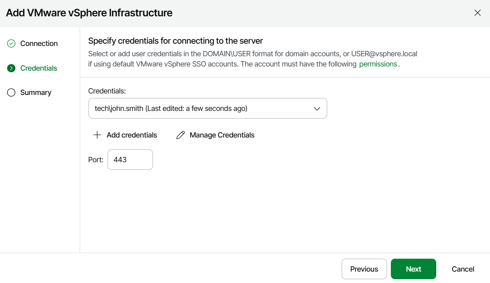

# Step 4. Specify Credentials

At the Credentials step of the wizard:

1. Click Add credentials and specify credentials of the user account for connecting to the server.

For details on adding credentials records, see [Security](credentials_manager.md). For details on account permissions, see [VMware vSphere Servers](connection_to_virtual_servers.md#vmware).

1. Change the port number if required.

By default, port 443 is used for communication with VMware vSphere servers.

1. When you add a vCenter Server or ESXi host, Veeam ONE saves to the configuration database a thumbprint of the TLS certificate installed on the vCenter Server or ESXi host. During every subsequent connection to the server, Veeam ONE uses the saved thumbprint to verify the server identity and avoid the man-in-the-middle attack.

If the certificate installed on the server is not trusted, Veeam ONE displays a warning.

+ To view detailed information about the certificate, click View Certificate.

+ If you trust the server, click Trust and Continue.

+ If you do not trust the server, click Cancel. Veeam ONE will display an error message, and you will not be able to connect to the server.

