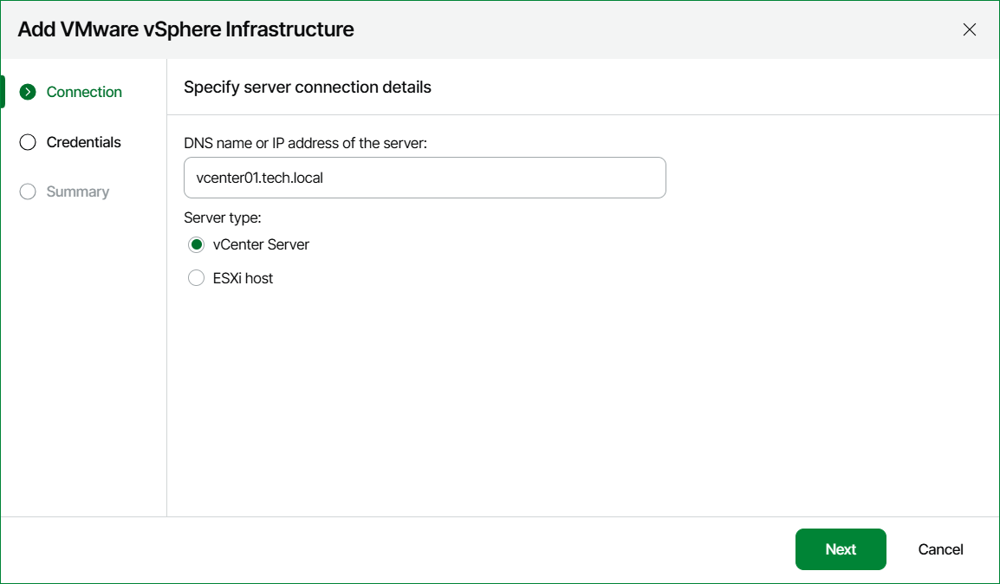

# Step 3. Specify Server Name and Role

At the Connection step of the wizard:

1. Specify DNS name or IP address of the server that you want to connect.
2. Specify the port number if other than the default 443.
3. Specify the server role — vCenter Server or a standalone ESXi host.

Page updated 2026-05-13

