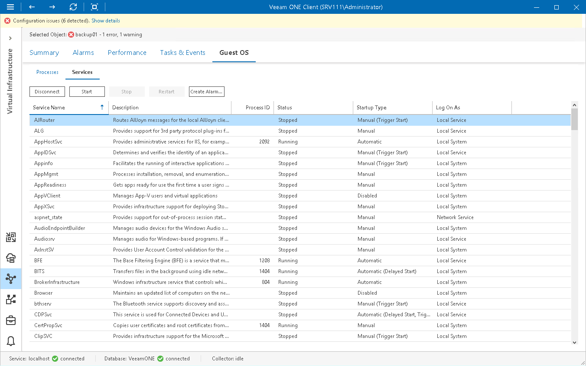

# VMware vSphere In-Guest Services

You can view and control services currently running inside a VM or vCenter Server.

* For Windows-based machines, you can view, start, stop and restart services, and create alarms based on retrieved services.
* For Linux-based machines, you can view or end services.

Prerequisites

Before viewing in-guest services, check the following prerequisites:

* For VMs, make sure that VMware Tools are installed.

* For Linux-based machines, make sure that the SSH Server is started.

Viewing In-Guest Services

To view the list of services:

1. Open Veeam ONE Client.

For details, see [Accessing Veeam ONE Components](access.md).

1. At the bottom of the inventory pane, click Virtual Infrastructure.
2. In the inventory pane, select the necessary infrastructure object.
3. Open the Guest OS tab and navigate to Services.
4. Provide OS authentication credentials (user name and password) to access the list of running services.

You can start, stop and restart a running service, or create an alarm based on the service state or object performance:

* To restart a service, click the Restart button, or right-click a necessary service and select Restart from the shortcut menu.

* To disconnect from guest OS, click the Disconnect button.
* [For Windows-based machines] To create an alarm, select a service in the list, click the Create Alarm button, and select the type of rule on which the alarm must be based. For details on alarm rules, see [Alarm Rules Reference](appendix_rules_alarms.md).

