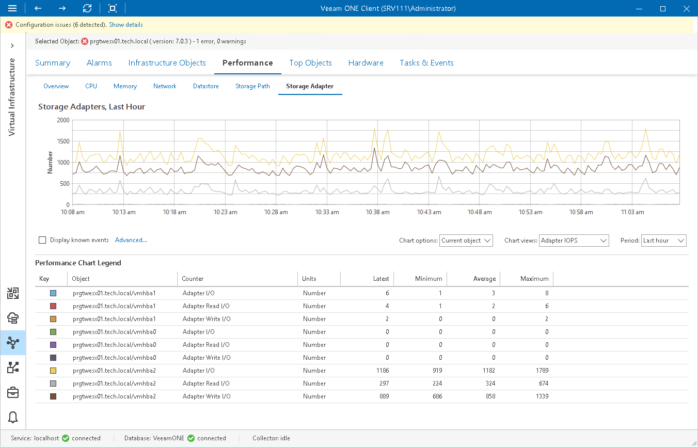

# Storage Adapter Performance Chart

The Storage Adapter chart displays historical statistics for the storage adapters on the selected host.

The following table provides information on predefined views and counters.

Storage Adapter Performance Chart

| Chart View | Counter | Measurement Unit | Description |
| Adapter IOPS | Adapter I/O | Number | Average number of commands issued per second on a storage path during the collection interval. |
| Adapter Read I/O | Number | Average number of read commands issued per second on a storage path during the collection interval. |
| Adapter Write I/O | Number | Average number of write commands issued per second on a storage path during the collection interval. |
| Adapter Usage Rates | Adapter Read Rate | MB/s | Rate at which data is read on a storage path. |
| Adapter Write Rate | MB/s | Rate at which data is written on a storage path. |
| Adapter Latency | Adapter Read Latency | Millisecond | Average amount of time that a read operation on a storage path takes. |
| Adapter Write Latency | Millisecond | Average amount of time that a write operation on a storage path takes. |

