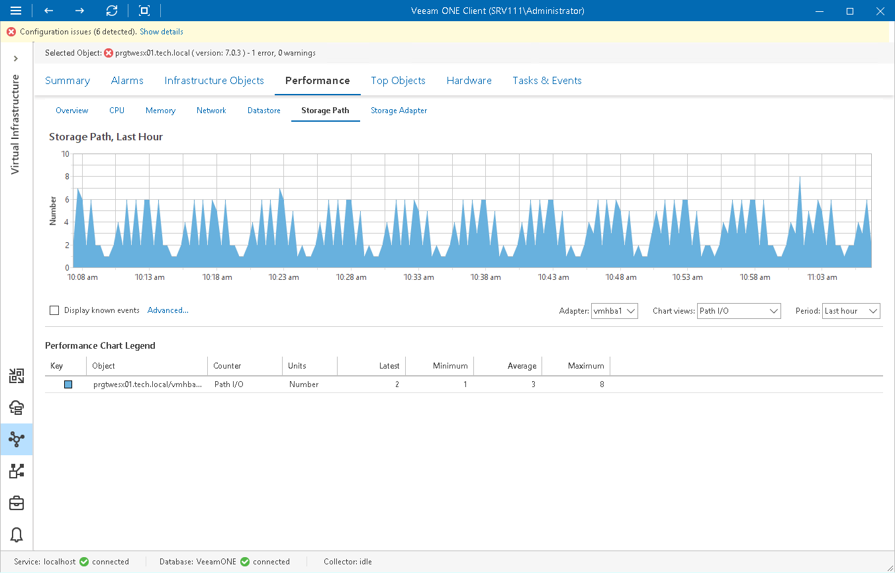

# Storage Path Performance Chart

The Storage Path chart displays historical statistics for paths used by the storage adapter on the selected host.

You can switch between adapters using the Adapter list below the performance chart.

The name of each storage device connected to the storage adapter through the selected path is specified after the host address (separated by a forward slash). It has the following format: <HBA>:<SCSI target>:<SCSI LUN>:<disk partition>

The following table provides information on predefined views and counters.

Storage Path Performance Chart

| Chart View | Measurement Unit | Description |
| Path I/O | Number | Average number of commands issued per second through a path. |
| Path Read I/O | Number | Average number of read commands issued per second through a path. |
| Path Write I/O | Number | Average number of write commands issued per second through a path. |
| Path Read Rate | MB/s | Rate at which data is read through a path. |
| Path Write Rate | MB/s | Rate at which data is written through a path. |
| Path Read Latency | Millisecond | Average amount of time taken for a read operation through a path. |
| Path Write Latency | Millisecond | Average amount of time that a write operation through a path takes. |

Page updated 2026-08-03

