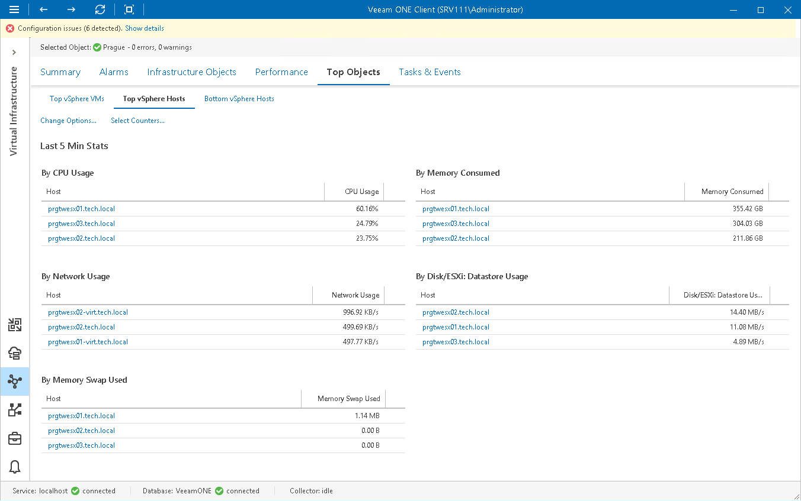

# VMware vSphere Top Objects

The Top Objects dashboards help you detect VMs and hosts consuming the most and the least amount of resources in the selected virtual infrastructure segment:

* Top vSphere VMs dashboard displays top VM consumers in terms of CPU, memory, datastore, network usage, memory swapped, active snapshot size, active snapshot age and the number of existing snapshots.
* Top vSphere Hosts dashboard displays top host consumers in terms of CPU, memory, datastore, network usage and swapped memory.
* Bottom vSphere Hosts dashboard displays least loaded hosts in terms of CPU, memory, datastore, network and memory swap used.

You can use this dashboard to choose hosts where you can deploy new VMs or to which you can move existing VMs.

To detect the most and the least loaded hosts or VMs:

1. Open Veeam ONE Client.

For details, see [Accessing Veeam ONE Components](access.md).

1. At the bottom of the inventory pane, click Virtual Infrastructure.
2. In the inventory pane, select the necessary infrastructure container.
3. Open the Top Objects tab and switch to the necessary dashboard — Top vSphere VMs, Top vSphere Hosts or Bottom vSphere Hosts.
4. At the top left corner of the dashboard, click the Change Options link.

1. In the Interval field, set the time interval for which resource utilization statistics must be analyzed.
2. In the VMs to display/Hosts to display field, specify the number of objects to display on the dashboard.

1. At the top left corner of the dashboard, click the Select Counters link.

1. In the Select Counters window, choose metrics that must be included in the dashboard.

Press and hold the [SHIFT] or [CTRL] key on the keyboard to select multiple counters.

1. Click OK.

