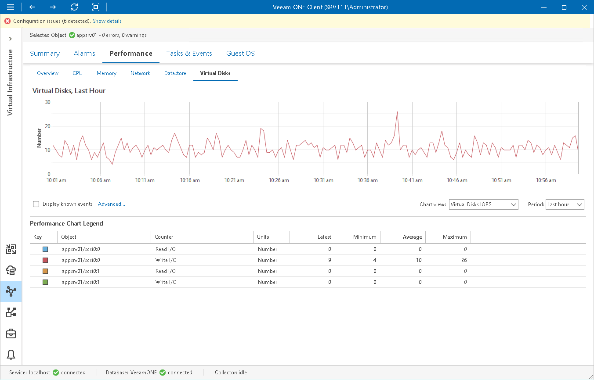

# Virtual Disks Performance Chart

The Virtual Disks chart displays historical statistics for partitions of all disks on the selected VM.

The following table provides information on predefined views and counters.

Virtual Disks Performance Chart

| Chat View | Counter | Measurement Unit | Description |
| Virtual Disks IOPS | Read I/O | Number | Average number of read operations issued per second to a virtual disk. |
| Write I/O | Number | Average number of write operations issued per second to a virtual disk. |
| Virtual Disks Usage Rates | Read Rate | MB/s | Rate at which data is read from a virtual disk. |
| Write Rate | MB/s | Rate at which data is written to a virtual disk. |
| Virtual Disks Latency | Read Latency | Millisecond | Average amount of time that a read operation from a virtual disk takes. |
| Write Latency | Millisecond | Average amount of time that a write operation to a virtual disk takes. |

