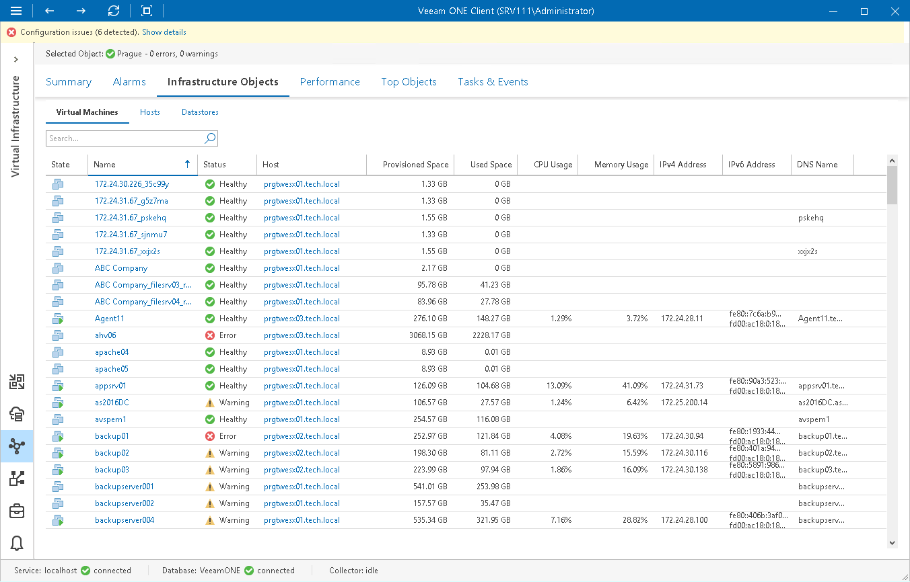

# VMware vSphere Virtual Machines

You can view the list of VMs within a virtual infrastructure container — on a host, on a datastore, in a folder and so on.

To view the list of VMs:

1. Open Veeam ONE Client.

For details, see [Accessing Veeam ONE Components](access.md).

1. At the bottom of the inventory pane, click Virtual Infrastructure.
2. In the inventory pane, select the necessary infrastructure container.
3. Open the Infrastructure Objects tab and navigate to Virtual Machines.
4. To find the necessary VM by name, use the Search field at the top of the list.
5. Click column names to sort VMs by a specific parameter.

For example, to view what VMs are consuming the greatest amount of memory, you can sort VMs in the list by Memory Usage.

For every VM in the list, the following details are available:

* State — state of the VM (powered on, powered off, suspended)
* Name — name of the VM
* Status — current status of the VM in terms of alarms (healthy, warning or error)
* Host — name of the host on which the VM resides
* Provisioned Space — amount of storage space provisioned for the VM
* Used Space — amount of storage space actually used for storing VM files (for VMs with thin provisioned disks, this value is normally less than Provisioned Space)
* CPU Usage — amount of actively used virtual CPU as a percentage of total available CPU resources
* Memory Usage — amount of actively used memory resources as a percentage of configured VM memory
* IP V4 Address — IP v4 address assigned to the VM
* IP V6 Address — IP v6 address assigned to the VM
* DNS Name — DNS name of the VM
* vCPU — number of virtual CPUs configured for the VM
* Assigned Memory — amount of virtual memory allocated for the VM
* Guest OS — guest operating system installed in the VM
* VMware Tools — state of VMware Tools
* Hardware Version — hardware version of the VM

You can choose what columns to show or hide in the Virtual Machines table:

* To hide one or more columns, right-click the table header, and clear check boxes next to the corresponding data fields.
* To make hidden columns visible, right-click the table header, and select check boxes next to the corresponding data fields.

