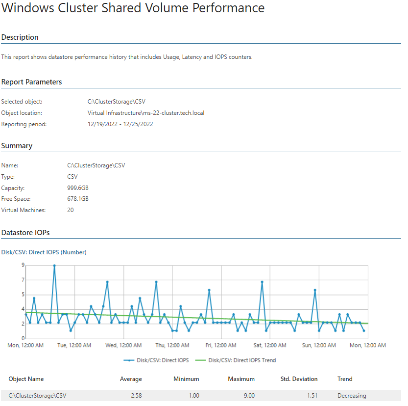
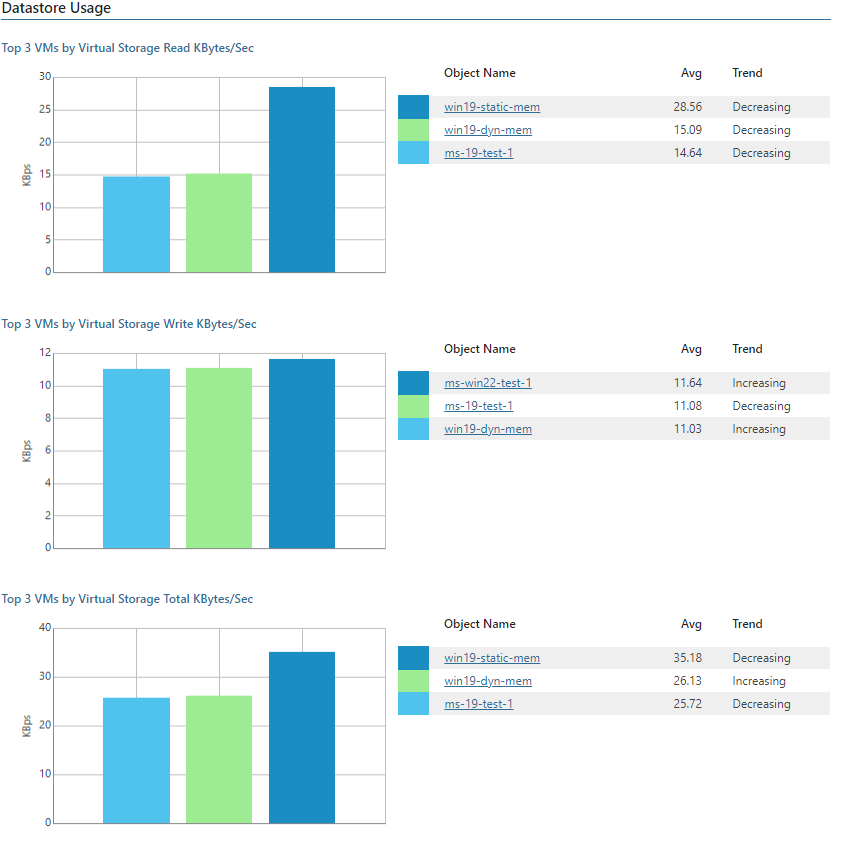
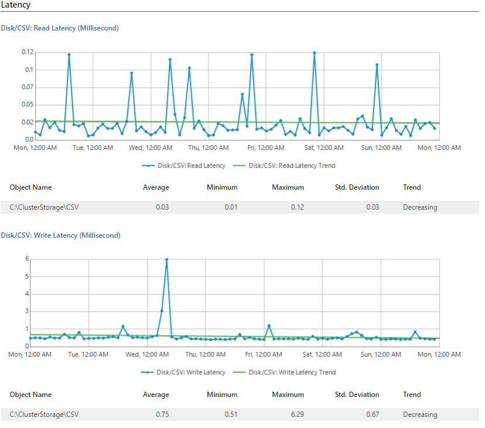

# Windows Cluster Shared Volume Performance

This report aggregates historical data and shows performance statistics for a selected Windows 2012+ Server Cluster Shared Volume across a time range.

* The Performance subsections provide information on read/write rates, read/write operations completed in the direct/redirected access mode, read/write latency, IOPS, top 3 resource consuming VMs and usage trends for the CSV.

Click a VM name in the list of top 3 resource consuming VMs to drill down to performance charts with statistics on CPU, memory, disk and network usage for the VM.

Report Parameters

You can specify the following report parameters:

* Object: defines the Windows 2012+ Server CSV to analyze in the report.
* Period: defines the time period to analyze in the report. Note that the reporting period must include at least one successfully completed Object properties data collection task for the selected CSV. Otherwise, the report will contain no data.
* Business hours only: defines time of a day for which historical performance data will be used to calculate the performance trend. All data beyond this interval will be excluded from the baseline used for data analysis.

Use Case

The report assesses latency and IOPS values to identify Windows 2012+ Server Cluster Shared Volumes with performance issues.

Page updated 2026-08-03

